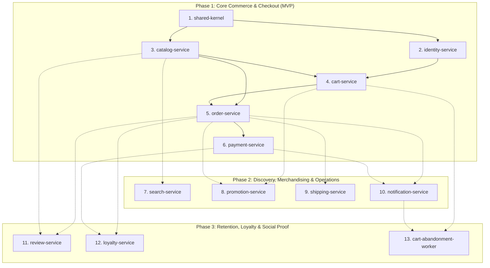

# 🗺️ Shopizy Microservices — Module Decomposition Roadmap

This roadmap decomposes the **Shopizy Modern Headless E-Commerce Platform** into independent, dependency-ordered microservice modules across the 3 product roadmap phases.

---

## Roadmap Overview



---

## Detailed Execution Sequence

| Phase | Module Name | Slug | Dependencies | Primary Responsibilities | Automated E2E Scenarios |
| :--- | :--- | :--- | :--- | :--- | :--- |
| **Phase 1** | **Shared Kernel & Aspire Orchestrator** | `shared-kernel` | None | `.NET Aspire` (`Shopizy.AppHost`, `Shopizy.ServiceDefaults`), base domain entities, Result pattern, MassTransit integration event contracts, Outbox abstractions, Global error handling | Test Aspire AppHost container wiring, Serilog/OTel health checks, serializing and deserializing shared integration event contracts |
| **Phase 1** | **Identity & Access Service** | `identity-service` | `shared-kernel` | User registration (12-char strong password), JWT authentication, refresh tokens, role claims (`Customer`, `StoreAdmin`), user directory | 1. User registers & logs in<br/>2. Customer cannot access StoreAdmin directory<br/>3. Token refresh cycle |
| **Phase 1** | **Product Catalog Service** | `catalog-service` | `shared-kernel`, `identity-service` | Hierarchical categories, brands, parent-variant dimensional matrix (SKU, barcode, price, stock), image galleries, optimistic concurrency | 1. StoreAdmin creates category hierarchy & variant products<br/>2. Customer browses catalog and views variant stock |
| **Phase 1** | **Shopping Cart Service** | `cart-service` | `shared-kernel`, `catalog-service` | Redis-backed shopping cart, add/update/remove line items, price snapshotting on add, price discrepancy detection | 1. Customer adds variants to cart with price snapshot<br/>2. Price change in catalog triggers alert at checkout review |
| **Phase 1** | **Order & Inventory Service** | `order-service` | `catalog-service`, `cart-service`, `identity-service` | Atomic stock reservation, idempotent order creation, 15-minute unpaid expiration auto-cancellation, restock on cancellation | 1. Successful checkout with stock reservation<br/>2. Zero overselling rejection when stock insufficient<br/>3. Unpaid order expires in 15 mins and releases stock |
| **Phase 1** | **Payment & Refund Gateway** | `payment-service` | `order-service`, `shared-kernel` | Tokenized card payment processing, payment state reconciliation, automated refund trigger on pre-shipment order cancellation | 1. Order paid successfully transitions order to `Processing`<br/>2. Cancelled order triggers automatic gateway refund |
| **Phase 2** | **Search & Discovery Engine** | `search-service` | `catalog-service`, `shared-kernel` | Elasticsearch/Meilisearch sync, typo-tolerance, retail synonyms, multi-attribute faceted filters (<500ms response) | 1. Search with typo `"iphne"` returns `"iPhone"`<br/>2. Faceted filtering by price, brand, rating, and in-stock flag |
| **Phase 2** | **Promotion & Coupon Service** | `promotion-service` | `order-service`, `cart-service` | Percentage/fixed coupons, minimum spend rules, BOGO rules, category limits, safety discount caps | 1. Apply qualifying coupon to order subtotal<br/>2. BOGO discount calculated accurately<br/>3. Expired or capped coupon rejected |
| **Phase 2** | **Shipping & Tracking Service** | `shipping-service` | `order-service`, `shared-kernel` | Carrier rate calculation (USPS, UPS, FedEx, DHL), free shipping threshold ($75), milestone tracking updates | 1. Rate calculated based on parcel weight & destination<br/>2. Free shipping applies above threshold<br/>3. Carrier tracking milestones update order |
| **Phase 2** | **Notification & Real-Time Push** | `notification-service` | `order-service`, `payment-service` | SignalR WebSocket hub with Redis backplane, live order tracking push (<1s), live merchant sales feed, transactional email dispatch | 1. Order status change broadcasts to customer tracking screen<br/>2. Live revenue updates stream to merchant dashboard |
| **Phase 3** | **Reviews, Ratings & Wishlists** | `review-service` | `order-service`, `catalog-service` | 1-5 star reviews with photos, verified buyer badge validation (confirmed delivered order required), helpfulness upvoting, wishlists & alerts | 1. Verified buyer submits review after delivery<br/>2. Non-buyer rejected from verified badge<br/>3. Wishlist price drop alert triggered |
| **Phase 3** | **Loyalty Points & Gift Cards** | `loyalty-service` | `order-service`, `payment-service` | Point accumulation on completed orders, point redemption at checkout, digital gift card issuance and partial balance spending | 1. Customer earns points on order delivery<br/>2. Customer redeems points for discount at checkout<br/>3. Gift card partial balance deduction |
| **Phase 3** | **Abandoned Cart Recovery** | `cart-abandonment-worker` | `cart-service`, `notification-service` | Background detection of inactive carts (>2 hours), deduplication cooldown, personalized email dispatch with direct restore link | 1. Cart inactive for 2 hours triggers recovery email<br/>2. Cooldown prevents duplicate email for same session |

---

## Next Steps

To begin implementation according to the SDD workflow:
1. Generate the formal module specification for Module 1 (`shared-kernel`) with verifiable unit, integration, and E2E test criteria using:
   ```bash
   /sdd-spec shared-kernel
   ```
2. Or use the Python CLI:
   ```bash
   python scripts/sdd_engine.py spec --module shared-kernel
   ```
