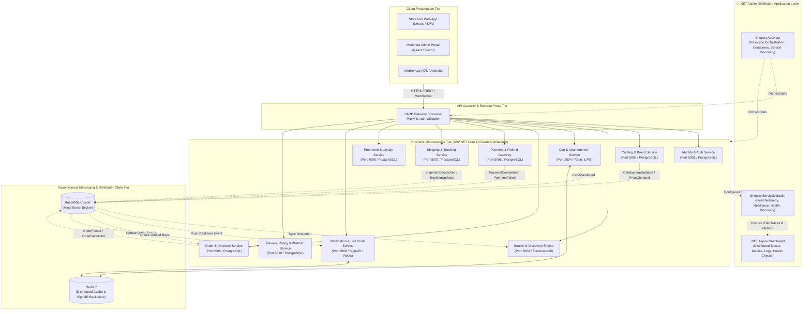
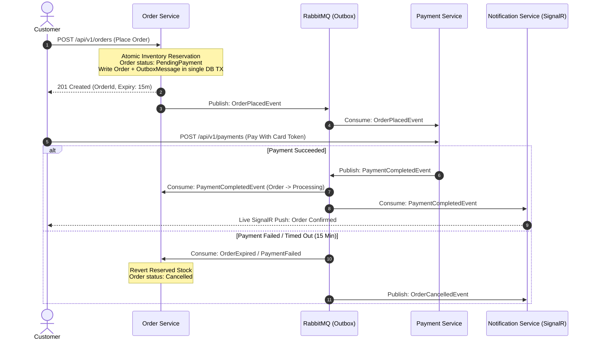

# 🏗️ Shopizy Microservices — System Architecture Blueprint

> **Status:** Ratified & Approved  
> **Backend Framework:** ASP.NET Core 10 (C# 14)  
> **Orchestration & Observability:** .NET Aspire (`Shopizy.AppHost`, `Shopizy.ServiceDefaults`)  
> **Architectural Paradigm:** Clean Architecture, Domain-Driven Design (DDD), Event-Driven Microservices  
> **Message Broker:** RabbitMQ + MassTransit  
> **Primary Databases:** PostgreSQL 17, Redis 7 (Cache & Backplane), Elasticsearch / Meilisearch (Search Engine)  

---

## 1. Executive Architectural Overview & Topology

Shopizy is architected as an enterprise headless digital commerce platform consisting of autonomous, independently deployable microservices organized around core business subdomains, orchestrated and monitored via **.NET Aspire**.

---

## 2. Technology Stack & Rationale

| Layer / Concern | Technology Selection | Architectural Rationale |
| :--- | :--- | :--- |
| **Cloud Orchestration** | **.NET Aspire 10 (`Shopizy.AppHost`, `Shopizy.ServiceDefaults`)** | Unified local developer inner-loop orchestration, container lifecycle (PostgreSQL, RabbitMQ, Redis, Elasticsearch), service discovery, and built-in OpenTelemetry dashboard. |
| **Runtime & Language** | **.NET 10 / C# 14** | High-throughput asynchronous performance, native memory efficiency, strong typing, and rich DDD ecosystem. |
| **Architecture Pattern** | **Clean Architecture (Hexagonal)** | Decouples Domain logic from Infrastructure (EF Core, RabbitMQ, HTTP), facilitating 100% unit-testable domain invariants. |
| **API Framework** | **ASP.NET Core Minimal APIs / FastEndpoints** | Minimal allocation overhead, native OpenAPI/Swagger generation, standard dependency injection. |
| **Primary Persistence** | **PostgreSQL 17 with EF Core 10** | Relational integrity, ACID guarantees for financial and inventory data, JSONB support for variant attributes. |
| **Search Engine** | **Elasticsearch / Meilisearch** | Dedicated inverted index supporting typo-tolerance, n-gram fuzzy matching, and multi-facet aggregations under 500ms. |
| **Message Broker** | **RabbitMQ + MassTransit** | Reliable asynchronous domain messaging, transactional outbox pattern, consumer retry policies, and saga state machines. |
| **Real-time Engine** | **ASP.NET Core SignalR + Redis Backplane** | Sub-second push notifications to customers (live order tracking) and store administrators (live sales feed). |
| **Distributed Caching** | **Redis 7 Stack** | Sub-millisecond session caching, cart snapshot caching, rate-limiting tokens, and SignalR scale-out. |
| **Testing Suite** | **xUnit, FluentAssertions, Moq, Testcontainers** | Verifiable unit tests with zero mocking for database integration tests via ephemeral Docker containers. |

---

## 3. Domain Model & Invariant Protections

### 3.1 Critical Business Invariants (Enforced via Domain Entities)

1. **Zero Overselling Invariant**:
   - Available stock is decremented atomically inside an ACID transaction (`UPDATE ProductStock SET Reserved = Reserved + @qty WHERE Available >= @qty`).
   - If reservation fails, checkout immediately rejects the line item before order creation.

2. **15-Minute Unpaid Order Expiration**:
   - Order enters `PendingPayment` state with an expiry timestamp (`CreatedAt + 15 min`).
   - A MassTransit Scheduled Message / Quartz background worker triggers `CancelUnpaidOrderCommand` upon expiry, reverting reserved inventory.

3. **Cart Price Snapshotting**:
   - When an item enters `CartItem`, the current unit price is snapshotted.
   - If catalog price changes subsequently, checkout prompts user verification prior to placing order.

4. **Verified Buyer Review Invariant**:
   - Creating a product review requires a confirmed `Delivered` order ID associated with the customer ID.
   - The Review Service validates order delivery status via domain event or direct query before granting the `Verified Buyer` badge.

---

## 4. Distributed Transaction & Saga Orchestration

Order placement, inventory reservation, and payment processing follow the **Transactional Outbox** pattern combined with **Choreographed / Orchestrated MassTransit Sagas**:

---

## 5. Security & Cross-Cutting Architecture

- **Identity & Authentication**: Stateless asymmetric JWT tokens signed via RSA (RS256). Claims include `sub` (UserId), `email`, and `roles` (`Customer`, `StoreAdmin`).
- **Data Isolation**: Strict tenant/user isolation. Application queries automatically filter by `CustomerId = CurrentUser.Id` for all non-admin routes.
- **Idempotency & Duplicate Prevention**: Order submission endpoints mandate an `Idempotency-Key` header cached in Redis for 60 seconds to prevent double charges.
- **Resilience & Fault Tolerance**: HTTP client resilience policies (Polly / Microsoft.Extensions.Resilience) with retry, circuit breaker, and timeout configurations.
- **Observability**: OpenTelemetry instrumentation emitting metrics, structured Serilog JSON logs with Correlation ID propagation, and distributed tracing.

---

## 6. Testing Strategy & Quality Gates

| Test Level | Scope | Tools & Frameworks | Quality Gate Minimum |
| :--- | :--- | :--- | :--- |
| **Unit Tests** | Domain entities, value objects, business rules, commands/queries | xUnit, FluentAssertions, Moq | $\ge 85\%$ Branch Coverage |
| **Integration Tests** | EF Core repositories, DB migrations, MassTransit consumers | xUnit, Testcontainers (PostgreSQL, RabbitMQ) | 100% Passing Database/Broker Tests |
| **API Contract Tests** | HTTP endpoints, status codes, DTO schemas, validation errors | `WebApplicationFactory<Program>`, Respawn | All endpoints verified against OpenAPI specs |
| **End-to-End Tests** | Full user journeys (Checkout, Auto-Expiry, Live tracking) | xUnit E2E suites + Playwright | Core business flows automated |

---

## 7. High Availability, Scalability & Flash-Sale Architecture

### 7.1 Database-per-Service Topology
- Each microservice owns an isolated PostgreSQL database (e.g. `shopizy_identity`, `shopizy_catalog`, `shopizy_order`, `shopizy_payment`).
- **Zero Cross-Database Joins**: Inter-service data queries use asynchronous event projections or read-optimized CQRS views.
- Eliminates noisy-neighbor connection pool exhaustion and enables independent DB schema migrations, backups, and point-in-time recovery.

### 7.2 High-Throughput Flash-Sale Inventory Reservation (Redis + Outbox)
Under extreme checkout load (e.g. 10,000 requests/sec for a limited sneaker release), direct row-level locking in PostgreSQL causes row lock contention (`SELECT ... FOR UPDATE` deadlocks).
- **Two-Tier Reservation Flow**:
  1. **Hot In-Memory Atomic Reservation**: A Redis Lua script executes an atomic decrement against `inventory:{sku}:available`. If available $< qty$, it rejects in sub-millisecond time without touching the relational database.
  2. **Durable Relational Outbox Commit**: Successfully reserved items enqueue an order creation command to PostgreSQL inside the Order Service transactional boundary, emitting `OrderPlacedEvent` via MassTransit Outbox.
  3. **Auto-Rollback on Expiry**: If unpaid after 15 minutes, the MassTransit expiration job releases the reservation both in PostgreSQL and Redis via Lua increment.

### 7.3 Read Scalability & CQRS
- **Write Path**: Handled by transactional commands (EF Core 10 writes to primary PostgreSQL).
- **Read Path**: Handled by lightweight queries (Dapper / EF Core `AsNoTracking`), backed by:
  - Multi-tier caching: In-memory `IMemoryCache` (L1) + Redis Distributed Cache (L2).
  - Search engine offloading: All catalog queries, keyword filters, and facet aggregations are served by Elasticsearch / Meilisearch, keeping primary DB load near zero during heavy browsing.

### 7.4 Cloud Infrastructure & KEDA Autoscaling
- **Target Platform**: **Azure Container Apps (ACA)** in production with native **KEDA** (Kubernetes Event-driven Autoscaling).
- **Scaling Triggers**:
  - **HTTP Traffic**: Scales based on concurrent requests per replica (e.g., scale out when concurrent requests $> 50$).
  - **RabbitMQ Queue Depth**: Background consumers (e.g., `OrderPlacedConsumer`, `ShippingDispatchConsumer`) scale dynamically based on unconsumed message lag, preventing queue backlog bottlenecks.
  - **Min / Max Replicas**: Critical services maintain minimum 2 replicas across Availability Zones for High Availability, scaling to 30+ replicas during peak load events.

