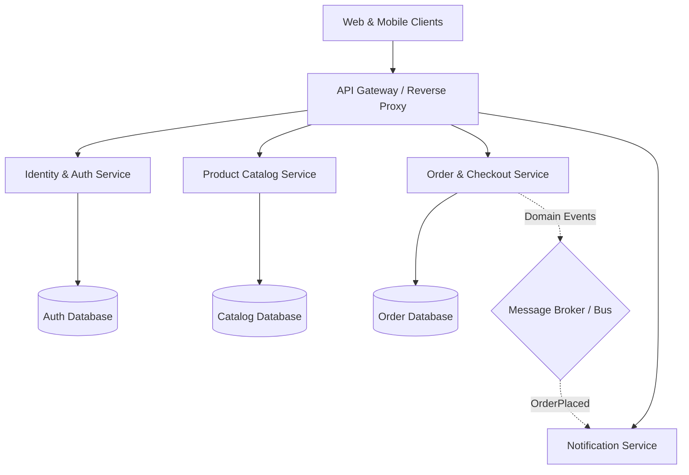

# System Architecture Blueprint

*Generated on 2026-09-05 19:40 via SDD Engine*

---

## 1. Executive Summary & Context
This architectural plan establishes the technical foundation derived from the Product Requirements Document (PRD) and user architectural interview.

## 2. Key Architectural Decisions (Interview Consensus)
- **Architectural Style**: Microservices (Independent service boundaries)
- **Persistence Layer**: PostgreSQL (Relational)
- **Messaging & Events**: RabbitMQ / MassTransit
- **Authentication & Security**: JWT Bearer Tokens with ASP.NET Core Identity / OAuth2
- **Automated E2E Testing**: xUnit + WebApplicationFactory (In-Memory HTTP)

---

## 3. High-Level System Topology

---

## 4. Cross-Cutting Standards
1. **API Contracts**: Standard REST APIs returning RFC 7807 Problem Details for all client and server errors.
2. **Resilience**: Polly retry policies, circuit breakers for out-of-process HTTP requests.
3. **Traceability**: Correlation IDs propagated across all HTTP headers and log contexts.
4. **Testing Obligation**: Every module must deliver Unit Tests, Integration Tests, and Automated E2E test suites with zero manual test dependency.

---

## 5. Module Roadmap Pointer
Refer to [module-decomposition.md](file:///d:/Projects/Github/akazad13/shopizy-microservice/.specify/architecture/module-decomposition.md) for execution phases.
