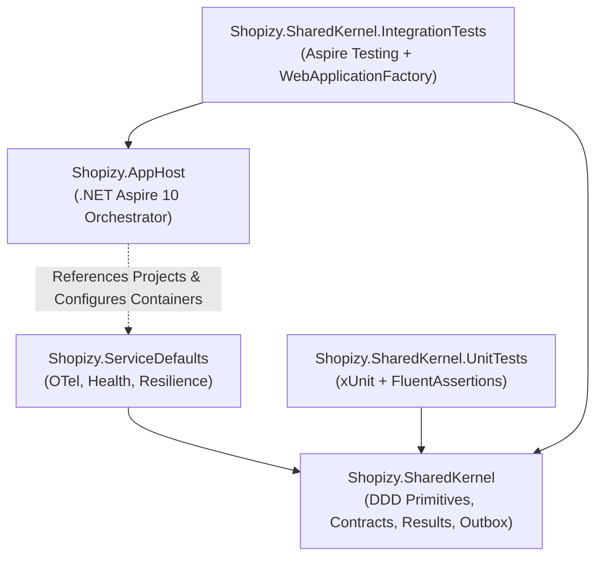

# Technical Implementation Plan: Shared Kernel & Aspire Orchestrator (`shared-kernel`)

> **Document Version:** 1.0.0  
> **Status:** Ratified  
> **Module Slug:** `shared-kernel`  
> **Target Framework:** .NET 10 (C# 14)  

---

## 1. Technical Strategy & Component Decomposition

The `shared-kernel` module delivers the foundational runtime and architectural framework for the entire Shopizy microservices ecosystem. It is composed of three core projects and two dedicated test suites:



---

## 2. Proposed Solution Directory Structure

```text
d:\Projects\Github\akazad13\shopizy-microservice\
├── Shopizy.slnx                                # Modern .NET 10 Solution file
├── src\
│   ├── Shopizy.SharedKernel\                   # Core Shared Library (No external DB/HTTP dependencies)
│   │   ├── Domain\
│   │   │   ├── Entity.cs                       # Entity<TId> base
│   │   │   ├── AggregateRoot.cs                # AggregateRoot<TId> with IDomainEvent collection
│   │   │   ├── ValueObject.cs                  # ValueObject with structural equality
│   │   │   ├── IDomainEvent.cs                 # Marker interface for in-process domain events
│   │   │   └── DomainException.cs              # Base domain exception
│   │   ├── Results\
│   │   │   ├── Result.cs                       # Functional Result and Result<TValue>
│   │   │   ├── Error.cs                        # Error code, message, and ErrorType enum
│   │   │   └── ErrorType.cs                    # Failure, Validation, NotFound, Conflict, Unauthorized
│   │   ├── Contracts\                          # Strongly-typed MassTransit Integration Events
│   │   │   ├── Orders\
│   │   │   │   ├── OrderPlacedIntegrationEvent.cs
│   │   │   │   ├── OrderCancelledIntegrationEvent.cs
│   │   │   │   └── OrderExpiredIntegrationEvent.cs
│   │   │   ├── Inventory\
│   │   │   │   ├── StockReservedIntegrationEvent.cs
│   │   │   │   ├── StockReservationFailedIntegrationEvent.cs
│   │   │   │   └── StockRestockedIntegrationEvent.cs
│   │   │   ├── Payments\
│   │   │   │   ├── PaymentCompletedIntegrationEvent.cs
│   │   │   │   └── PaymentFailedIntegrationEvent.cs
│   │   │   ├── Shipping\
│   │   │   │   └── ShipmentDispatchedIntegrationEvent.cs
│   │   │   └── Catalog\
│   │   │       └── ProductPriceChangedIntegrationEvent.cs
│   │   ├── Outbox\
│   │   │   ├── OutboxMessage.cs                # Outbox database entity
│   │   │   └── IOutboxStore.cs                 # Outbox persistence abstraction
│   │   └── Middleware\
│   │       ├── GlobalExceptionHandler.cs       # RFC 7807 IExceptionHandler implementation
│   │       └── Idempotency\
│   │           ├── IIdempotencyStore.cs
│   │           └── IdempotentAttribute.cs
│   ├── Shopizy.ServiceDefaults\                # .NET Aspire Service Defaults
│   │   ├── Extensions.cs                       # AddServiceDefaults & MapDefaultEndpoints
│   │   └── OpenTelemetryExtensions.cs          # Tracing, Metrics, and Serilog integration
│   └── Shopizy.AppHost\                        # .NET Aspire AppHost Orchestrator
│       ├── Program.cs                          # Orchestration: Postgres, Redis, RabbitMQ, Elasticsearch
│       └── appsettings.json
└── tests\
    ├── Shopizy.SharedKernel.UnitTests\         # Fast unit tests for DDD, Result, and serialization
    │   ├── Domain\
    │   │   ├── EntityTests.cs
    │   │   ├── ValueObjectTests.cs
    │   │   └── AggregateRootTests.cs
    │   ├── Results\
    │   │   └── ResultTests.cs
    │   └── Contracts\
    │       └── IntegrationEventSerializationTests.cs
    └── Shopizy.SharedKernel.IntegrationTests\  # Aspire AppHost & Middleware verification
        ├── AspireAppHostTests.cs
        ├── GlobalExceptionHandlerTests.cs
        └── IdempotencyStoreTests.cs
```

---

## 3. NuGet Package Dependencies

| Project | Package Name | Purpose |
| :--- | :--- | :--- |
| `Shopizy.SharedKernel` | `System.Text.Json` | High-performance JSON serialization |
| `Shopizy.SharedKernel` | `Microsoft.AspNetCore.Http.Abstractions` | RFC 7807 ProblemDetails and ExceptionHandler |
| `Shopizy.ServiceDefaults` | `Microsoft.Extensions.Http.Resilience` | Standard HTTP retry & circuit breaker policies |
| `Shopizy.ServiceDefaults` | `Microsoft.Extensions.ServiceDiscovery` | Dynamic microservice URI resolution |
| `Shopizy.ServiceDefaults` | `OpenTelemetry.Exporter.OpenTelemetryProtocol` | OTLP telemetry exporter to Aspire Dashboard |
| `Shopizy.ServiceDefaults` | `OpenTelemetry.Extensions.Hosting` | OpenTelemetry hosting extensions |
| `Shopizy.ServiceDefaults` | `OpenTelemetry.Instrumentation.AspNetCore` | HTTP request telemetry |
| `Shopizy.ServiceDefaults` | `OpenTelemetry.Instrumentation.Http` | Outbound HTTP client telemetry |
| `Shopizy.ServiceDefaults` | `OpenTelemetry.Instrumentation.Runtime` | GC, CPU, ThreadPool metrics |
| `Shopizy.AppHost` | `Aspire.Hosting.AppHost` | Aspire 10 orchestrator engine |
| `Shopizy.AppHost` | `Aspire.Hosting.PostgreSQL` | PostgreSQL container resource |
| `Shopizy.AppHost` | `Aspire.Hosting.Redis` | Redis container resource |
| `Shopizy.AppHost` | `Aspire.Hosting.RabbitMQ` | RabbitMQ container resource |
| Test Projects | `xunit`, `xunit.runner.visualstudio` | Testing runner |
| Test Projects | `FluentAssertions` | Readable, verifiable assertions |
| Test Projects | `Moq` | Interface mocking |
| Test Projects | `Aspire.Hosting.Testing` | In-memory integration testing of AppHost |

---

## 4. Execution Sequence & Quality Gates

1. **Gate 1**: Implement `Shopizy.SharedKernel` DDD types, Result pattern, and MassTransit event contracts.
2. **Gate 2**: Execute `Shopizy.SharedKernel.UnitTests` verifying 100% pass rate.
3. **Gate 3**: Implement `Shopizy.ServiceDefaults` and `Shopizy.AppHost`.
4. **Gate 4**: Execute `Shopizy.SharedKernel.IntegrationTests` verifying Aspire orchestration and health endpoints.
5. **Gate 5**: Final verification with `dotnet build --warnaserror` and `dotnet test`.
