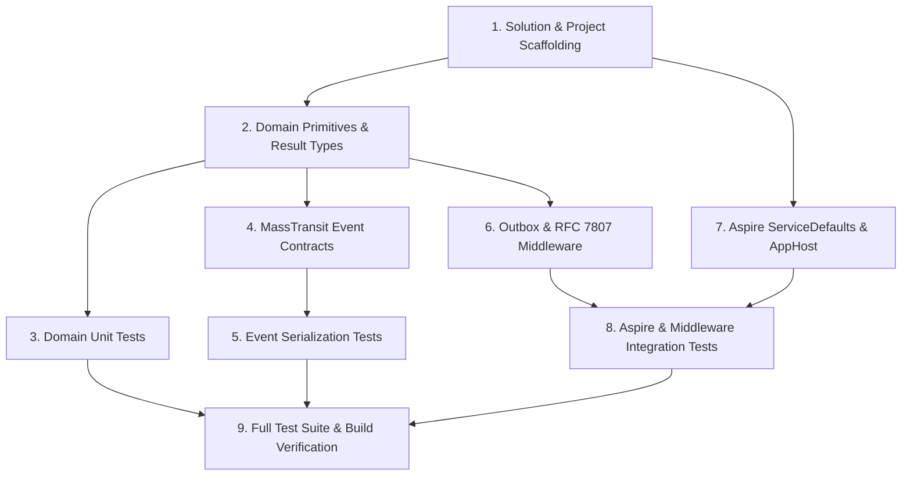

# Tasks: Shared Kernel & Aspire Orchestrator (`shared-kernel`)

> **Module Slug:** `shared-kernel`  
> **Status:** Completed & Verified  
> **Spec Reference:** [.specify/specs/shared-kernel/spec.md](file:///d:/Projects/Github/akazad13/shopizy-microservice/.specify/specs/shared-kernel/spec.md)  
> **Plan Reference:** [.specify/specs/shared-kernel/plan.md](file:///d:/Projects/Github/akazad13/shopizy-microservice/.specify/specs/shared-kernel/plan.md)  

---

## Task Dependencies & Flow

---

## Phase 1: Solution & Project Scaffolding

- [x] **Task 1.1**: Initialize `Shopizy.slnx` at the root if not present or configure solution structure.
- [x] **Task 1.2**: Create `src/Shopizy.SharedKernel` class library targeting .NET 10.
- [x] **Task 1.3**: Create `src/Shopizy.ServiceDefaults` library targeting .NET 10 with OpenTelemetry and HealthChecks.
- [x] **Task 1.4**: Create `src/Shopizy.AppHost` targeting .NET 10 with Aspire hosting packages.
- [x] **Task 1.5**: Create test projects `tests/Shopizy.SharedKernel.UnitTests` and `tests/Shopizy.SharedKernel.IntegrationTests` with xUnit, FluentAssertions, and Moq.

---

## Phase 2: Core Domain Primitives, Results & Unit Tests

- [x] **Task 2.1**: Implement `Entity<TId>` base class with identity equality semantics.
- [x] **Task 2.2**: Implement `ValueObject` base class with structural equality component comparison.
- [x] **Task 2.3**: Implement `AggregateRoot<TId>` with encapsulated domain event collection and raise/clear methods.
- [x] **Task 2.4**: Implement `Result` and `Result<TValue>` with `Error`, `ErrorType` (Failure, Validation, NotFound, Conflict, Unauthorized), and fluent mapping helpers.
- [x] **Task 2.5**: Implement Unit Tests for `Entity`, `ValueObject`, `AggregateRoot`, and `Result` in `Shopizy.SharedKernel.UnitTests`. Verify 100% pass rate.

---

## Phase 3: Integration Event Contracts & Serialization Tests

- [x] **Task 3.1**: Create `Shopizy.SharedKernel.Contracts.Orders` (`OrderPlacedIntegrationEvent`, `OrderCancelledIntegrationEvent`, `OrderExpiredIntegrationEvent`).
- [x] **Task 3.2**: Create `Shopizy.SharedKernel.Contracts.Inventory` (`StockReservedIntegrationEvent`, `StockReservationFailedIntegrationEvent`, `StockRestockedIntegrationEvent`).
- [x] **Task 3.3**: Create `Shopizy.SharedKernel.Contracts.Payments` (`PaymentCompletedIntegrationEvent`, `PaymentFailedIntegrationEvent`).
- [x] **Task 3.4**: Create `Shopizy.SharedKernel.Contracts.Shipping` (`ShipmentDispatchedIntegrationEvent`).
- [x] **Task 3.5**: Create `Shopizy.SharedKernel.Contracts.Catalog` (`ProductPriceChangedIntegrationEvent`).
- [x] **Task 3.6**: Implement unit tests verifying bidirectional JSON serialization round-trips for all event contracts with exact decimal and DateTime precision.

---

## Phase 4: Outbox, Middleware & Idempotency

- [x] **Task 4.1**: Implement `OutboxMessage` entity and `IOutboxStore` persistence contract.
- [x] **Task 4.2**: Implement `GlobalExceptionHandler` implementing `IExceptionHandler` returning RFC 7807 `ProblemDetails` for domain exceptions and system errors.
- [x] **Task 4.3**: Implement `IIdempotencyStore` and `IdempotencyMiddleware` for duplicate request interception.

---

## Phase 5: .NET Aspire ServiceDefaults & AppHost Orchestrator

- [x] **Task 5.1**: Implement `Shopizy.ServiceDefaults.Extensions`:
  - `AddServiceDefaults()`: OpenTelemetry tracing, metrics, standard health checks, HTTP resilience.
  - `MapDefaultEndpoints()`: Maps `/health` and `/alive` endpoints.
- [x] **Task 5.2**: Implement `Shopizy.AppHost`:
  - Configure PostgreSQL 17 container resource (`shopizy-postgres`).
  - Configure Redis 7 container resource (`shopizy-redis`).
  - Configure RabbitMQ container resource (`shopizy-rabbitmq`).

---

## Phase 6: Automated Integration & Verification Tests

- [x] **Task 6.1**: Implement `GlobalExceptionHandlerTests` using modern test server verifying RFC 7807 responses on 400 and 500 scenarios.
- [x] **Task 6.2**: Implement `IdempotencyStoreTests` verifying duplicate requests return cached results.
- [x] **Task 6.3**: Implement Aspire AppHost resource verification test using `Aspire.Hosting.Testing`.

---

## Phase 7: Verification & Quality Gate

- [x] **Task 7.1**: Run `dotnet build --warnaserror` across all projects to ensure zero warnings.
- [x] **Task 7.2**: Run `dotnet test --logger "console;verbosity=detailed"` ensuring all Unit and Integration tests pass cleanly.
- [x] **Task 7.3**: Update `checklist.md` and mark module verification complete.
