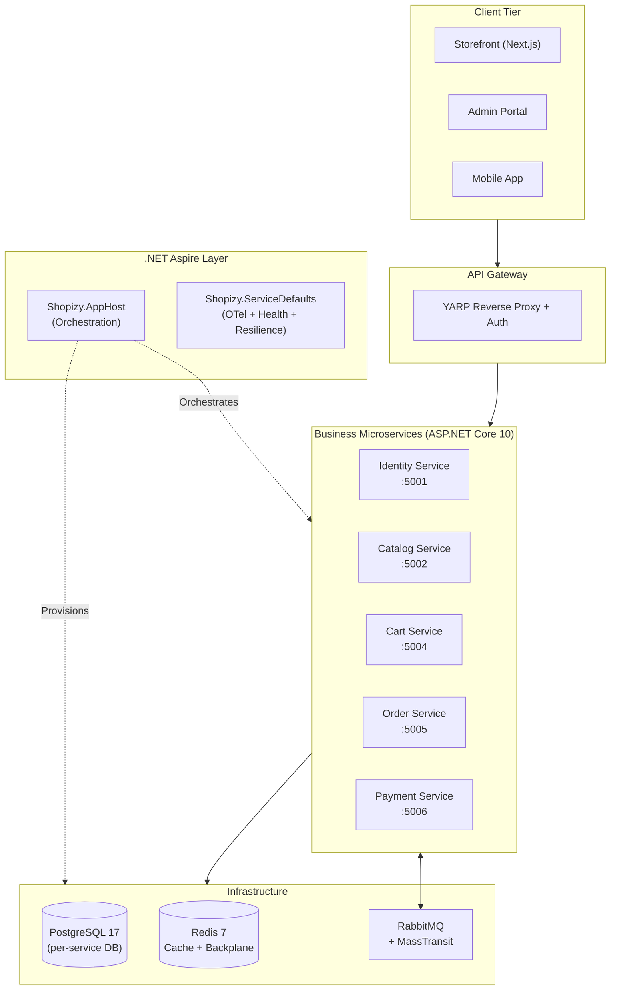

# 🛍️ Shopizy Microservices Platform

> **Enterprise headless e-commerce microservices platform** built end-to-end using a fully autonomous **Spec-Driven Development (SDD)** AI workflow powered by [Antigravity AI](https://antigravity.dev) and [GitHub Spec Kit](https://github.com/github/spec-kit).

[](https://github.com/akazad13/shopizy-microservice/actions/workflows/dotnet.yml)
[](https://github.com/akazad13/shopizy-microservice/actions/workflows/pr-review-agent.yml)

---

## 📖 Table of Contents

1. [What Is Shopizy?](#-what-is-shopizy)
2. [The SDD AI Workflow](#-the-sdd-ai-workflow)
3. [Using the Workflow](#-using-the-workflow)
4. [Peer Feedback Resolution Loop](#-peer-feedback-resolution-loop)
5. [Google AI PR Review Agent](#-google-ai-pr-review-agent)
6. [Architecture & Tech Stack](#-architecture--tech-stack)
7. [Module Roadmap & Status](#-module-roadmap--status)
8. [Project Structure](#-project-structure)
9. [Developer Quick Start](#-developer-quick-start)
10. [Project Constitution](#-project-constitution)
11. [Documentation](#-documentation)

---

## 🌟 What Is Shopizy?

Shopizy is an **enterprise-grade, headless digital commerce platform** built as a suite of independently deployable microservices. Each service owns its own domain, database, and API surface, communicating asynchronously via RabbitMQ events.

**Business capabilities delivered:**
- Zero-overselling atomic inventory reservation
- 15-minute unpaid order expiration with automatic stock release
- Idempotency protection on all financial operations
- Sub-second live order tracking push via SignalR + Redis
- Multi-tenant customer data isolation with JWT RBAC
- Flash-sale Redis Lua hot-key inventory protection

---

## 🤖 The SDD AI Workflow

Every module in this repository is built using a **fully autonomous 7-stage Spec-Driven Development pipeline**:

```mermaid
flowchart LR
    PRD["📄 1. Ingest PRD\n/sdd-intake"] --> Interview["🎙️ 2. Arch Interview\n(Interactive Q&A)"]
    Interview --> Blueprint["🏗️ 3. Architecture Blueprint\n+ Module Roadmap"]
    Blueprint --> Spec["📋 4. Module Spec\n/sdd-spec <module>"]
    Spec --> Loop["🔄 5. Generator ⟷ Reviewer\n/sdd-loop <module>"]
    Loop --> Tests["✅ 6. Automated Tests\n(Unit + Integration + E2E)"]
    Tests --> PR["🚀 7. GitHub PR\n/sdd-pr <module>"]
    PR --> Review["🤖 8. AI PR Review\n(Google AI Gemini)"]
    Review --> Feedback["🔁 9. Peer Feedback\nResolution Loop"]
    Feedback --> |"✅ APPROVED"| Merge["🎉 Merge"]
```



### How Each Stage Works

| Stage | Command | What Happens | Output Artifacts |
|:---|:---|:---|:---|
| **1. PRD Intake** | `/sdd-intake` | AI reads the PRD, builds system architecture, conducts an interactive architectural interview | `system-architecture.md`, `module-decomposition.md`, `constitution.md` |
| **2. Module Spec** | `/sdd-spec <module>` | Generates a formal module specification with unit, integration, and E2E test criteria | `spec.md`, `plan.md`, `tasks.md`, `checklist.md` |
| **3. Gen↔Review Loop** | `/sdd-loop <module>` | Generator Agent writes code; Review Agent audits against 5 pillars; loops until `APPROVED` | Source code, test suites, `review-log.md` |
| **4. GitHub PR** | `/sdd-pr <module>` | Creates feature branch, commits, generates traceability PR body, raises PR via `gh` | Feature branch, `pr-body.md`, GitHub PR |
| **5. AI PR Review** | *Automatic (GitHub Actions)* | Google AI Gemini audits the PR diff with line-numbered findings and a deterministic verdict | PR comment with `✅ APPROVED` / `⚠️ APPROVED WITH SUGGESTIONS` / `❌ CHANGES REQUESTED` |
| **6. Feedback Loop** | *Triggered on peer review* | AI ingests feedback, triages against the Constitution, applies targeted line patches, reruns tests, pushes remediation commit | Updated PR, re-triggered AI review |

---

## 🚀 Using the Workflow

### Prerequisites

```bash
# .NET 10 SDK
dotnet --version  # 10.x.x

# GitHub CLI (authenticated)
gh auth status

# Antigravity IDE (for slash commands)
```

### Starting a New Module — Step by Step

#### Step 1: Intake the PRD
```text
/sdd-intake docs/Shopizy_PRD.md
```
This conducts an interactive architectural interview and generates `.specify/architecture/`.

#### Step 2: Generate a Module Specification
```text
/sdd-spec identity-service
```
Generates the formal spec suite at `.specify/specs/identity-service/`:
- `spec.md` — user stories, acceptance criteria, and verifiable E2E test scenarios
- `plan.md` — technical design, component diagram, and API schemas
- `tasks.md` — ordered, actionable implementation task list
- `checklist.md` — pre-PR quality checklist

#### Step 3: Run the Generator ↔ Reviewer Loop
```text
/sdd-loop identity-service
```
The **Generator Agent** implements all production code and tests. The **Review Agent** audits across 5 pillars:

| Pillar | What Gets Checked |
|:---|:---|
| **Spec Adherence** | All user stories and acceptance criteria implemented? |
| **Test Completeness** | Unit, integration, and E2E tests present with meaningful assertions? |
| **Architecture & Standards** | Clean Architecture layers respected? Constitution compliant? |
| **Error & Edge Cases** | Nulls, boundaries, RFC 7807 Problem Details, unauthorized paths? |
| **Security & Performance** | OWASP guidelines, JWT auth, idempotency on financial endpoints? |

If any pillar fails → feedback passed back to the Generator Agent → code is patched → reviewer re-audits (up to 3 cycles).

#### Step 4: Raise the Pull Request
```text
/sdd-pr identity-service
```
- Verifies build (`dotnet build --warnaserror`) and all tests pass
- Creates a stacked feature branch (`feature/identity-service` branched from `feature/shared-kernel`)
- Raises PR with full traceability to PRD sections, spec files, and review-log

#### Step 5: Google AI Reviewer Runs Automatically
On PR open/push, GitHub Actions triggers the Google AI PR Review Agent which:
- Reads the PR diff and project constitution
- Posts line-numbered findings using `file:L<start>-L<end>` references
- Issues a deterministic verdict (`✅ APPROVED`, `⚠️ APPROVED WITH SUGGESTIONS`, `❌ CHANGES REQUESTED`)

#### Step 6: Resolve Peer Feedback
When a reviewer (human or AI) posts suggestions:
> *"Address the feedback on PR #2"*

The AI agent:
1. Ingests all review comment threads
2. Audits each suggestion against the Constitution
3. Applies the targeted line-by-line fix
4. Runs `dotnet build --warnaserror` and `dotnet test` locally
5. Commits and pushes a remediation commit
6. The AI Review Agent auto-re-runs and updates the PR verdict

---

## 🔁 Peer Feedback Resolution Loop


---

## 🤖 Google AI PR Review Agent

Every PR automatically receives a detailed code review from **Google AI (Gemini)** via GitHub Actions.

### What the Agent Reviews

The agent reads the full PR diff and cross-references:
- The **Project Constitution** (`.specify/memory/constitution.md`)
- The **PR description** (traceability to spec and acceptance criteria)
- Clean Architecture layer dependencies

### Line-by-Line Finding Format

```markdown
#### 📍 `src/Shopizy.ServiceDefaults/Extensions.cs:L88-L98` — [Severity: Major] Finding Title
- **Issue**: Precise technical description
- **Current Code**: <exact snippet from diff>
- **Suggested Fix**: <concrete, copy-pasteable replacement>
- **Rationale**: Engineering reason (e.g., prevents probe failure in production)
```

### Verdict Decision Matrix

| Verdict | Triggered When | Merge Blocking? |
|:---|:---|:---:|
| `❌ CHANGES REQUESTED` | ANY finding with severity `[Critical]` or `[Major]` | ⛔ YES |
| `⚠️ APPROVED WITH SUGGESTIONS` | All gates pass; only `[Minor]` or `[Nit]` items remain | 🟢 NO |
| `✅ APPROVED` | Zero findings; 100% spec compliance; all tests pass | 🟢 NO |

### Configuration

The review agent uses:
- **Script**: [`.github/scripts/pr_review_agent.py`](.github/scripts/pr_review_agent.py)
- **Workflow**: [`.github/workflows/pr-review-agent.yml`](.github/workflows/pr-review-agent.yml)
- **Secret Required**: `GEMINI_API_KEY` in repository secrets

---

## 🏗️ Architecture & Tech Stack

| Layer | Technology |
|:---|:---|
| **Runtime** | .NET 10 / C# 14 |
| **Architecture Pattern** | Clean Architecture + DDD + CQRS (MediatR) |
| **Orchestration** | .NET Aspire 10 (`Shopizy.AppHost` + `Shopizy.ServiceDefaults`) |
| **API** | ASP.NET Core 10 Minimal APIs + YARP Reverse Proxy |
| **Database** | PostgreSQL 17 (database-per-service) via EF Core 10 |
| **Caching / Sessions** | Redis 7 |
| **Messaging** | RabbitMQ + MassTransit (Transactional Outbox pattern) |
| **Search** | Elasticsearch / Meilisearch |
| **Real-Time** | ASP.NET Core SignalR + Redis backplane |
| **Observability** | OpenTelemetry (traces + metrics) + Serilog + .NET Aspire Dashboard |
| **Resilience** | Polly (retry, circuit breaker, timeout) via `Microsoft.Extensions.Http.Resilience` |
| **Testing** | xUnit + FluentAssertions + Aspire test host |
| **CI/CD** | GitHub Actions (.NET 10 SDK build + AI PR Review) |
| **AI Reviewer** | Google AI Gemini via Gemini API |

### System Topology



---

## 📦 Module Roadmap & Status

### Phase 1: Core Commerce & Checkout (MVP)

| # | Module | Branch | PR | Status | Tests |
|:---:|:---|:---|:---:|:---:|:---:|
| 1 | **Shared Kernel & Aspire Orchestrator** | `feature/shared-kernel` | [#1](https://github.com/akazad13/shopizy-microservice/pull/1) | ✅ APPROVED | 30/30 |
| 2 | **Identity & Access Service** | `feature/identity-service` | — | 🔜 Next | — |
| 3 | **Product Catalog Service** | `feature/catalog-service` | — | ⏳ Pending | — |
| 4 | **Shopping Cart Service** | `feature/cart-service` | — | ⏳ Pending | — |
| 5 | **Order & Inventory Service** | `feature/order-service` | — | ⏳ Pending | — |
| 6 | **Payment & Refund Gateway** | `feature/payment-service` | — | ⏳ Pending | — |

### Phase 2: Discovery, Merchandising & Operations

| # | Module | Status |
|:---:|:---|:---:|
| 7 | Search & Discovery Engine | ⏳ Pending |
| 8 | Promotion & Coupon Service | ⏳ Pending |
| 9 | Shipping & Tracking Service | ⏳ Pending |
| 10 | Notification & Real-Time Push | ⏳ Pending |

### Phase 3: Retention, Loyalty & Social Proof

| # | Module | Status |
|:---:|:---|:---:|
| 11 | Reviews, Ratings & Wishlists | ⏳ Pending |
| 12 | Loyalty Points & Gift Cards | ⏳ Pending |
| 13 | Abandoned Cart Recovery Worker | ⏳ Pending |

> **Stacked PR Strategy**: Each module branches from the previous module's feature branch so development is never blocked by pending PR merges. For example, `feature/identity-service` is branched from `feature/shared-kernel`.

---

## 📁 Project Structure

```
shopizy-microservice/
├── src/
│   ├── Shopizy.SharedKernel/           # DDD primitives, Result<T>, event contracts, middleware
│   ├── Shopizy.ServiceDefaults/        # OpenTelemetry, health checks, Polly resilience
│   └── Shopizy.AppHost/               # .NET Aspire 10 orchestrator
├── tests/
│   ├── Shopizy.SharedKernel.UnitTests/ # 23 unit tests
│   └── Shopizy.SharedKernel.IntegrationTests/  # 7 integration tests
├── .specify/
│   ├── architecture/
│   │   ├── system-architecture.md     # Full topology & tech rationale
│   │   ├── module-decomposition.md    # 13-module roadmap with E2E scenarios
│   │   └── interview-answers.json     # Ratified architectural decisions
│   ├── memory/
│   │   └── constitution.md            # 8 non-negotiable engineering principles
│   └── specs/<module-slug>/
│       ├── spec.md                    # User stories & acceptance criteria
│       ├── plan.md                    # Technical design & API schemas
│       ├── tasks.md                   # Ordered implementation task list
│       ├── checklist.md               # Pre-PR quality checklist
│       ├── review-log.md              # Multi-agent audit trail & test results
│       └── pr-body.md                 # Generated PR description
├── .agents/
│   └── skills/                        # Antigravity AI skill definitions
│       ├── sdd-intake/SKILL.md        # PRD ingestion & architecture interview
│       ├── sdd-spec/SKILL.md          # Module specification generator
│       ├── sdd-loop/SKILL.md          # Generator ↔ Reviewer refinement loop
│       ├── sdd-pr/SKILL.md            # Automated PR creation
│       └── speckit-*/SKILL.md         # GitHub Spec Kit base skills
├── .github/
│   ├── workflows/
│   │   ├── dotnet.yml                 # .NET 10 CI: build + test
│   │   └── pr-review-agent.yml        # Google AI PR Review Agent
│   └── scripts/
│       └── pr_review_agent.py         # Gemini-powered review script
└── docs/
    ├── Shopizy_PRD.md                 # Product Requirements Document
    ├── sdd-workflow-guide.md          # Detailed workflow guide
    └── SPEC_DRIVEN_AI_WORKFLOW_PLAN.md
```

---

## 🏃 Developer Quick Start

### Clone & Build

```bash
git clone https://github.com/akazad13/shopizy-microservice.git
cd shopizy-microservice

dotnet restore Shopizy.sln
dotnet build Shopizy.sln --warnaserror
```

### Run All Tests

```bash
dotnet test Shopizy.sln
# Expected: 30 passed, 0 failed
```

### Run Locally with .NET Aspire

```bash
dotnet run --project src/Shopizy.AppHost
# Opens .NET Aspire Dashboard at https://localhost:15888
# Provisions: PostgreSQL 17, Redis 7, RabbitMQ
```

### Run the AI Workflow (In Antigravity Chat)

```text
# Start a new module:
/sdd-spec identity-service

# Run the full generation + review loop:
/sdd-loop identity-service

# Create the GitHub PR:
/sdd-pr identity-service
```

---

## 📜 Project Constitution

The Shopizy Platform operates under **8 non-negotiable engineering principles** defined in [`.specify/memory/constitution.md`](.specify/memory/constitution.md):

| Principle | Rule |
|:---|:---|
| **I. Clean Architecture** | Domain layer contains zero ORM, framework, or web dependencies |
| **II. Zero Overselling** | Stock reservation is atomic; 15-min unpaid expiry is mandatory |
| **III. Event-Driven Decoupling** | No synchronous cross-service writes; use Transactional Outbox |
| **IV. Test-First Quality** | Every spec defines test criteria before implementation begins |
| **V. Zero Trust Security** | JWT Bearer required; multi-tenant data isolation at query level |
| **VI. Idempotency** | All financial endpoints require and validate `Idempotency-Key` |
| **VII. Database-per-Service** | No cross-database queries or cross-service foreign keys |
| **VIII. Hot-Key Inventory** | Flash-sale protection via atomic Redis Lua scripts |

---

## 📚 Documentation

| Document | Description |
|:---|:---|
| [Shopizy PRD](docs/Shopizy_PRD.md) | Full Product Requirements Document |
| [SDD Workflow Guide](docs/sdd-workflow-guide.md) | Detailed step-by-step workflow guide |
| [System Architecture Blueprint](.specify/architecture/system-architecture.md) | Full topology, CQRS, and infrastructure rationale |
| [Module Decomposition Roadmap](.specify/architecture/module-decomposition.md) | 13-module dependency graph with E2E scenarios |
| [Project Constitution](.specify/memory/constitution.md) | 8 non-negotiable engineering principles |
| [Shared Kernel Spec](. specify/specs/shared-kernel/spec.md) | Module 1 formal specification |
| [Shared Kernel Review Log](.specify/specs/shared-kernel/review-log.md) | Audit trail (3 cycles, AI + peer feedback) |

---

## 🤝 Contributing

All contributions must go through the SDD workflow:
1. Create a spec with `/sdd-spec <your-module>`
2. Implement via `/sdd-loop <your-module>`
3. Raise PR via `/sdd-pr <your-module>`
4. All PRs are automatically reviewed by the Google AI Review Agent
5. Address feedback using the [Peer Feedback Resolution Loop](#-peer-feedback-resolution-loop)

---

*Built with ❤️ using [Antigravity AI](https://antigravity.dev) × [GitHub Spec Kit](https://github.com/github/spec-kit)*
