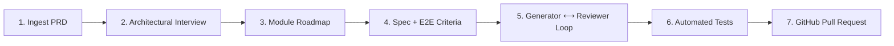

# 🛍️ Shopizy Microservices Platform

An enterprise-grade, cloud-native e-commerce microservices platform built using **Spec-Driven Development (SDD)** with [GitHub Spec Kit](https://github.com/github/spec-kit) and **Antigravity AI**.

---

## 🌟 Spec-Driven Full AI Workflow

This project is configured with an end-to-end, autonomous Spec-Driven Development workflow:



### Key Highlights
1. **Interactive Architectural Interview**: Discovers architectural trade-offs, service boundaries, database choices, and testing strategies before writing code.
2. **Individual Specs with Automated E2E Criteria**: Generates formal module specifications (`spec.md`, `plan.md`, `tasks.md`, `checklist.md`) with explicit unit, integration, and automated E2E test scenarios.
3. **Multi-Agent Refinement Loop**: Generator Agent writes code and test suites; an adversarial Review Agent audits quality, security, and test fidelity in a closed feedback loop.
4. **Automated Testing & GitHub PRs**: Executes test suites and raises clean GitHub Pull Requests via GitHub CLI (`gh`).

---

## 🚀 Getting Started

### 1. Interactive AI Mode (In Antigravity Chat)

You can invoke the workflow directly in conversation using specialized Antigravity slash commands:

| Command | Action |
| :--- | :--- |
| `/sdd-intake <prd>` | Ingests PRD, creates system architecture, and conducts interactive interview |
| `/sdd-spec <module>` | Generates formal specification with automated unit, integration, and E2E criteria |
| `/sdd-loop <module>` | Runs Generator ⟷ Reviewer iterative refinement loop and executes test suite |
| `/sdd-pr <module>` | Verifies tests, creates feature branch, and raises GitHub PR |

> **Example**:
> *"Here is my PRD: [paste PRD or path `docs/sample-prd.md`]. Please run `/sdd-intake`."*

---

### 2. Autonomous CLI Engine Mode

You can also run the pipeline or any individual phase directly via the Python orchestrator:

```bash
# Run the entire pipeline end-to-end:
python scripts/sdd_engine.py run-all --prd docs/sample-prd.md --module auth-service

# Or step-by-step:
python scripts/sdd_engine.py intake --prd docs/sample-prd.md
python scripts/sdd_engine.py spec --module catalog-service
python scripts/sdd_engine.py loop --module catalog-service --iterations 3
python scripts/sdd_engine.py pr --module catalog-service
```

---

## 📚 Documentation
- [Spec-Driven AI Workflow Plan](file:///d:/Projects/Github/akazad13/shopizy-microservice/docs/SPEC_DRIVEN_AI_WORKFLOW_PLAN.md)
- [Complete SDD Workflow Guide](file:///d:/Projects/Github/akazad13/shopizy-microservice/docs/sdd-workflow-guide.md)
- [Sample PRD](file:///d:/Projects/Github/akazad13/shopizy-microservice/docs/sample-prd.md)
- [System Architecture Blueprint](file:///d:/Projects/Github/akazad13/shopizy-microservice/.specify/architecture/system-architecture.md)
- [Module Roadmap & Decomposition](file:///d:/Projects/Github/akazad13/shopizy-microservice/.specify/architecture/module-decomposition.md)
