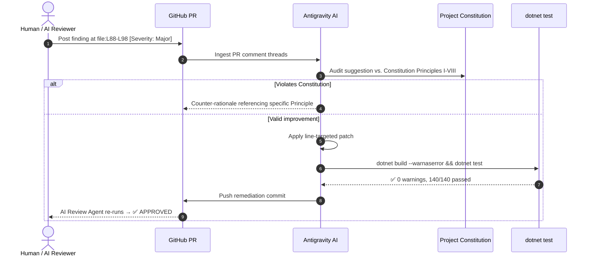
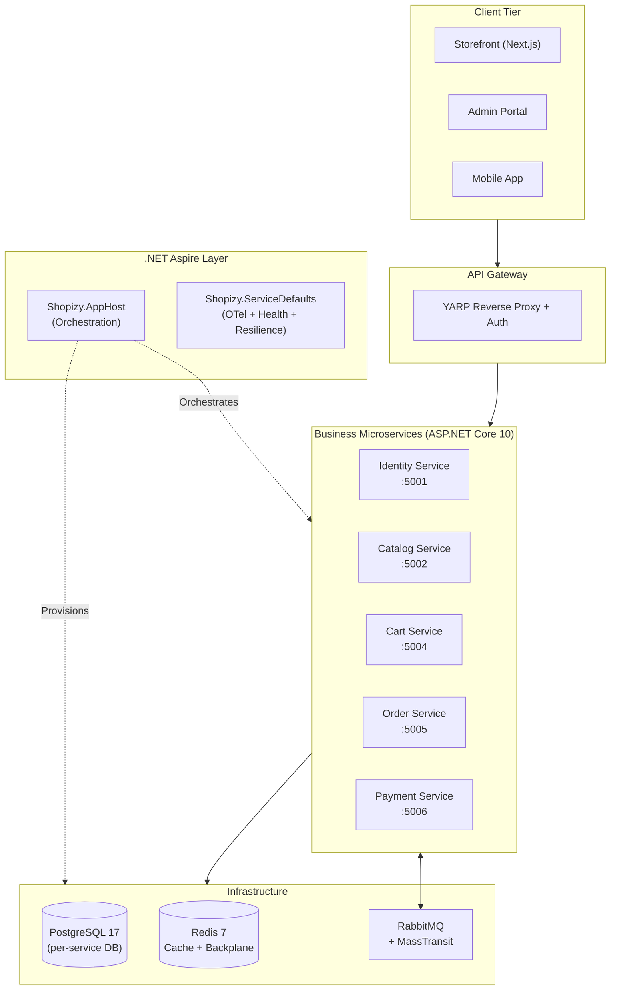

# 🛍️ Shopizy Microservices Platform

> **Enterprise headless e-commerce microservices platform** built end-to-end using a fully autonomous **Spec-Driven Development (SDD)** AI workflow powered by [Antigravity AI](https://antigravity.dev) and [GitHub Spec Kit](https://github.com/github/spec-kit).

[](https://github.com/akazad13/shopizy-microservice/actions/workflows/dotnet.yml)
[](https://github.com/akazad13/shopizy-microservice/actions/workflows/pr-review-agent.yml)

---

## 📖 Table of Contents

1. [What Is Shopizy?](#-what-is-shopizy)
2. [The SDD AI Workflow](#-the-sdd-ai-workflow)
3. [Using the Workflow](#-using-the-workflow)
4. [Peer Feedback Resolution Loop](#-peer-feedback-resolution-loop)
5. [Google AI PR Review Agent](#-google-ai-pr-review-agent)
6. [Architecture & Tech Stack](#-architecture--tech-stack)
7. [Module Roadmap & Status](#-module-roadmap--status)
8. [Project Structure](#-project-structure)
9. [Developer Quick Start](#-developer-quick-start)
10. [Project Constitution](#-project-constitution)
11. [Documentation](#-documentation)

---

## 🌟 What Is Shopizy?

Shopizy is an **enterprise-grade, headless digital commerce platform** built as a suite of independently deployable microservices. Each service owns its own domain, database, and API surface, communicating asynchronously via RabbitMQ events and orchestrated locally via .NET Aspire.

**Business capabilities delivered:**
- Zero-overselling atomic inventory reservation
- Hierarchical category trees & brand directory
- Parent-variant dimensional product matrix (SKUs, barcodes, pricing, stock, JSON attributes)
- Optimistic concurrency control on product updates and stock modifications
- 15-minute unpaid order expiration with automatic stock release
- Idempotency protection on financial and mutating operations via `Idempotency-Key`
- Sub-second live order tracking push via SignalR + Redis
- Multi-tenant customer data isolation with cryptographic JWT RBAC
- Flash-sale Redis Lua hot-key inventory protection

---

## 🤖 The SDD AI Workflow

Every module in this repository is built using a **fully autonomous 7-stage Spec-Driven Development pipeline**:

```mermaid
flowchart LR
    PRD["📄 1. Ingest PRD\n/sdd-intake"] --> Interview["🎙️ 2. Arch Interview\n(Interactive Q&A)"]
    Interview --> Blueprint["🏗️ 3. Architecture Blueprint\n+ Module Roadmap"]
    Blueprint --> Spec["📋 4. Module Spec\n/sdd-spec <module>"]
    Spec --> Loop["🔄 5. Generator ⟷ Reviewer\n/sdd-loop <module>"]
    Loop --> Tests["✅ 6. Automated Tests\n(Unit + Integration + E2E)"]
    Tests --> PR["🚀 7. GitHub PR\n/sdd-pr <module>"]
    PR --> Review["🤖 8. AI PR Review\n(Google AI Gemini)"]
    Review --> Feedback["🔁 9. Peer Feedback\nResolution Loop"]
    Feedback --> |"✅ APPROVED"| Merge["🎉 Merge"]
```



### How Each Stage Works

| Stage | Command | What Happens | Output Artifacts |
|:---|:---|:---|:---|
| **1. PRD Intake** | `/sdd-intake` | AI reads the PRD, builds system architecture, conducts an interactive architectural interview | `system-architecture.md`, `module-decomposition.md`, `constitution.md` |
| **2. Module Spec** | `/sdd-spec <module>` | Generates a formal module specification with unit, integration, and E2E test criteria | `spec.md`, `plan.md`, `tasks.md`, `checklist.md` |
| **3. Gen↔Review Loop** | `/sdd-loop <module>` | Generator Agent writes code; Review Agent audits against 5 pillars; loops until `APPROVED` | Source code, test suites, `review-log.md` |
| **4. GitHub PR** | `/sdd-pr <module>` | Creates feature branch, commits, generates traceability PR body, raises PR via `gh` | Feature branch, `pr-body.md`, GitHub PR |
| **5. AI PR Review** | *Automatic (GitHub Actions)* | Google AI Gemini audits the PR diff with line-numbered findings and a deterministic verdict | PR comment with `✅ APPROVED` / `⚠️ APPROVED WITH SUGGESTIONS` / `❌ CHANGES REQUESTED` |
| **6. Feedback Loop** | *Triggered on peer review* | AI ingests feedback, triages against the Constitution, applies targeted line patches, reruns tests, pushes remediation commit | Updated PR, re-triggered AI review |

---

## 🚀 Using the Workflow

### Prerequisites

```bash
# .NET 10 SDK
dotnet --version  # 10.x.x

# GitHub CLI (authenticated)
gh auth status

# Antigravity IDE (for slash commands)
```

### Starting a New Module — Step by Step

#### Step 1: Intake the PRD
```text
/sdd-intake docs/Shopizy_PRD.md
```
This conducts an interactive architectural interview and generates `.specify/architecture/`.

#### Step 2: Generate a Module Specification
```text
/sdd-spec catalog-service
```
Generates the formal spec suite at `.specify/specs/catalog-service/`:
- `spec.md` — user stories, acceptance criteria, and verifiable E2E test scenarios
- `plan.md` — technical design, component diagram, and API schemas
- `tasks.md` — ordered, actionable implementation task list
- `checklist.md` — pre-PR quality checklist

#### Step 3: Run the Generator ↔ Reviewer Loop
```text
/sdd-loop catalog-service
```
The **Generator Agent** implements all production code and tests. The **Review Agent** audits across 5 pillars:

| Pillar | What Gets Checked |
|:---|:---|
| **Spec Adherence** | All user stories and acceptance criteria implemented? |
| **Test Completeness** | Unit, integration, and E2E tests present with meaningful assertions? |
| **Architecture & Standards** | Clean Architecture layers respected? Constitution compliant? |
| **Error & Edge Cases** | Nulls, boundaries, RFC 7807 Problem Details, unauthorized paths? |
| **Security & Performance** | OWASP guidelines, JWT auth, idempotency on financial & mutating endpoints? |

If any pillar fails → feedback passed back to the Generator Agent → code is patched → reviewer re-audits (up to 3 cycles).

#### Step 4: Raise the Pull Request
```text
/sdd-pr catalog-service
```
- Verifies build (`dotnet build --warnaserror`) and all tests pass
- Creates a feature branch (`feature/catalog-service`)
- Raises PR with full traceability to PRD sections, spec files, and review-log

#### Step 5: Google AI Reviewer Runs Automatically
On PR open/push, GitHub Actions triggers the Google AI PR Review Agent which:
- Reads the PR diff and project constitution
- Posts line-numbered findings using `file:L<start>-L<end>` references
- Issues a deterministic verdict (`✅ APPROVED`, `⚠️ APPROVED WITH SUGGESTIONS`, `❌ CHANGES REQUESTED`)

#### Step 6: Resolve Peer Feedback
When a reviewer (human or AI) posts suggestions:
> *"Address the feedback on PR #4"*

The AI agent:
1. Ingests all review comment threads
2. Audits each suggestion against the Constitution
3. Applies the targeted line-by-line fix
4. Runs `dotnet build --warnaserror` and `dotnet test` locally
5. Commits and pushes a remediation commit
6. The AI Review Agent auto-re-runs and updates the PR verdict

---

## 🔁 Peer Feedback Resolution Loop



---

## 🤖 Google AI PR Review Agent

Every PR automatically receives a detailed code review from **Google AI (Gemini)** via GitHub Actions.

### What the Agent Reviews

The agent reads the full PR diff and cross-references:
- The **Project Constitution** (`.specify/memory/constitution.md`)
- The **PR description** (traceability to spec and acceptance criteria)
- Clean Architecture layer dependencies

### Line-by-Line Finding Format

```markdown
#### 📍 `src/Shopizy.AppHost/Program.cs:L16-L19` — [Severity: Minor] Aspire Database Resource Scoping & Isolation
- **Issue**: Precise technical description
- **Current Code**: <exact snippet from diff>
- **Suggested Fix**: <concrete, copy-pasteable replacement>
- **Rationale**: Engineering reason (e.g., enforces Principle VII database-per-service isolation)
```

### Verdict Decision Matrix

| Verdict | Triggered When | Merge Blocking? |
|:---|:---|:---:|
| `❌ CHANGES REQUESTED` | ANY finding with severity `[Critical]` or `[Major]` | ⛔ YES |
| `⚠️ APPROVED WITH SUGGESTIONS` | All gates pass; only `[Minor]` or `[Nit]` items remain | 🟢 NO |
| `✅ APPROVED` | Zero findings; 100% spec compliance; all tests pass | 🟢 NO |

### Configuration

The review agent uses:
- **Script**: [`.github/scripts/pr_review_agent.py`](.github/scripts/pr_review_agent.py)
- **Workflow**: [`.github/workflows/pr-review-agent.yml`](.github/workflows/pr-review-agent.yml)
- **Secret Required**: `GEMINI_API_KEY` in repository secrets

---

## 🏗️ Architecture & Tech Stack

| Layer | Technology |
|:---|:---|
| **Runtime** | .NET 10 / C# 14 |
| **Architecture Pattern** | Clean Architecture + DDD + CQRS |
| **Orchestration** | .NET Aspire 10 (`Shopizy.AppHost` + `Shopizy.ServiceDefaults`) |
| **API** | ASP.NET Core 10 Minimal APIs + YARP Reverse Proxy |
| **Database** | PostgreSQL 17 (database-per-service) via EF Core 10 |
| **Caching / Sessions** | Redis 7 |
| **Messaging** | RabbitMQ + MassTransit (Transactional Outbox pattern) |
| **Search** | Elasticsearch / Meilisearch |
| **Real-Time** | ASP.NET Core SignalR + Redis backplane |
| **Observability** | OpenTelemetry (traces + metrics) + Serilog + .NET Aspire Dashboard |
| **Resilience** | Polly (retry, circuit breaker, timeout) via `Microsoft.Extensions.Http.Resilience` |
| **Testing** | xUnit + FluentAssertions + WebApplicationFactory test host |
| **CI/CD** | GitHub Actions (.NET 10 SDK build + AI PR Review) |
| **AI Reviewer** | Google AI Gemini via Gemini API |

### System Topology



---

## 📦 Module Roadmap & Status

### Phase 1: Core Commerce & Checkout (MVP)

| # | Module | Branch | PR | Status | Tests |
|:---:|:---|:---|:---:|:---:|:---:|
| 1 | **Shared Kernel & Aspire Orchestrator** | `feature/shared-kernel` | [#1](https://github.com/akazad13/shopizy-microservice/pull/1) | ✅ MERGED | 30/30 |
| 2 | **Identity & Access Service** | `feature/identity-service` | [#2](https://github.com/akazad13/shopizy-microservice/pull/2), [#3](https://github.com/akazad13/shopizy-microservice/pull/3) | ✅ MERGED | 48/48 |
| 3 | **Product Catalog Service** | `feature/catalog-service` | [#4](https://github.com/akazad13/shopizy-microservice/pull/4) | ✅ MERGED | 62/62 |
| 4 | **Shopping Cart Service** | `feature/cart-service` | [#6](https://github.com/akazad13/shopizy-microservice/pull/6) | ✅ MERGED | 38/38 |
| 5 | **Order & Inventory Service** | `feature/order-service` | [#7](https://github.com/akazad13/shopizy-microservice/pull/7) | ✅ MERGED | 33/33 |
| 6 | **Payment & Refund Gateway** | `feature/payment-service` | [#8](https://github.com/akazad13/shopizy-microservice/pull/8) | ✅ MERGED | 15/15 |

### Phase 2: Discovery, Merchandising & Operations

| # | Module | Branch | PR | Status | Tests |
|:---:|:---|:---|:---:|:---:|:---:|
| 7 | **Search & Discovery Engine** | `feature/search-service` | [#9](https://github.com/akazad13/shopizy-microservice/pull/9) | ✅ MERGED | 19/19 |
| 8 | **Promotion & Coupon Service** | `feature/promotion-service` | [#10](https://github.com/akazad13/shopizy-microservice/pull/10) | ✅ MERGED | 12/12 |
| 9 | **Shipping & Tracking Service** | `feature/shipping-service` | [#11](https://github.com/akazad13/shopizy-microservice/pull/11) | ✅ MERGED | 12/12 |
| 10 | **Notification & Real-Time Push** | `feature/notification-service` | [#12](https://github.com/akazad13/shopizy-microservice/pull/12) | ✅ MERGED | 12/12 |

### Phase 3: Retention, Loyalty & Social Proof

| # | Module | Branch | PR | Status | Tests |
|:---:|:---|:---|:---:|:---:|:---:|
| 11 | **Reviews, Ratings & Wishlists** | `feature/review-service` | [#13](https://github.com/akazad13/shopizy-microservice/pull/13) | ✅ MERGED | 17/17 |
| 12 | Loyalty Points & Gift Cards | | | ⏳ Pending | |
| 13 | Abandoned Cart Recovery Worker | | | ⏳ Pending | |

---

## 📁 Project Structure

```
shopizy-microservice/
├── src/
│   ├── Shopizy.SharedKernel/                  # DDD primitives, Result<T>, event contracts, idempotency middleware
│   ├── Shopizy.ServiceDefaults/               # OpenTelemetry, health checks, Polly resilience
│   ├── Shopizy.AppHost/                      # .NET Aspire 10 orchestrator (Postgres, Redis, RabbitMQ)
│   ├── Shopizy.IdentityService/               # User registration, JWT auth, refresh tokens, RBAC, isolation
│   ├── Shopizy.CatalogService/                # Hierarchical categories, brands, variants, optimistic concurrency
│   ├── Shopizy.CartService/                   # Redis-backed shopping cart, price snapshotting, discrepancy alerts, merge
│   ├── Shopizy.OrderService/                  # Atomic stock reservation, zero-overselling, 15-min auto-expiration, restocking
│   ├── Shopizy.PaymentService/                # Tokenized payment processing, gateway reconciliation, automated refunds
│   ├── Shopizy.SearchService/                 # Fuzzy matching, retail synonyms, "Did You Mean?", multi-attribute faceting
│   ├── Shopizy.PromotionService/              # Discount campaigns, safety cap ceilings, BOGO, minimum spend rules
│   ├── Shopizy.ShippingService/               # Multi-carrier rate engine, USPS $75 threshold, milestone tracking
│   ├── Shopizy.NotificationService/           # SignalR real-time hubs, transactional email dispatch, merchant feed
│   └── Shopizy.ReviewService/                 # 1-5 star reviews, verified buyer badge, helpfulness voting, wishlists
├── tests/
│   ├── Shopizy.SharedKernel.UnitTests/        # 23 unit tests
│   ├── Shopizy.SharedKernel.IntegrationTests/ # 7 integration tests
│   ├── Shopizy.IdentityService.UnitTests/      # 38 unit tests (password policy, user aggregate, isolation)
│   ├── Shopizy.IdentityService.IntegrationTests/ # 4 integration tests (EF Core persistence, tokens)
│   ├── Shopizy.IdentityService.E2ETests/       # 6 automated E2E tests (auth, RBAC, data isolation, idempotency)
│   ├── Shopizy.CatalogService.UnitTests/       # 46 unit tests (categories, brands, products, variants, money)
│   ├── Shopizy.CatalogService.IntegrationTests/# 9 integration tests (category trees, search, concurrency)
│   ├── Shopizy.CatalogService.E2ETests/        # 7 automated E2E tests (catalog hierarchy, variants, RBAC, replay)
│   ├── Shopizy.CartService.UnitTests/          # 27 unit tests (item mutations, price snapshotting, subtotal)
│   ├── Shopizy.CartService.IntegrationTests/   # 5 integration tests (Redis persistence roundtrip, TTL)
│   ├── Shopizy.CartService.E2ETests/           # 6 automated E2E tests (guest lifecycle, merge, discrepancy, isolation)
│   ├── Shopizy.OrderService.UnitTests/         # 24 unit tests (state machine, stock reservation, expiration)
│   ├── Shopizy.OrderService.IntegrationTests/  # 3 integration tests (EF Core persistence, isolation)
│   ├── Shopizy.OrderService.E2ETests/          # 6 automated E2E tests (checkout, zero-overselling, 15-min expiry, idempotency)
│   ├── Shopizy.PaymentService.UnitTests/       # 7 unit tests (payment state machine, refund validation, currency check)
│   ├── Shopizy.PaymentService.IntegrationTests/# 2 integration tests (EF Core persistence, refund records)
│   ├── Shopizy.PaymentService.E2ETests/        # 6 automated E2E tests (card charge, declines, refunds, idempotency)
│   ├── Shopizy.SearchService.UnitTests/         # 11 unit tests (fuzzy matching, Damerau-Levenshtein, synonyms, pagination safety)
│   ├── Shopizy.SearchService.IntegrationTests/  # 2 integration tests (index store faceting, filtering)
│   ├── Shopizy.SearchService.E2ETests/          # 6 automated E2E tests (typo tolerance, synonyms, did-you-mean, facets, filtering, RBAC)
│   ├── Shopizy.PromotionService.UnitTests/      # 4 unit tests (percentage caps, fixed discounts, minimum spend, BOGO)
│   ├── Shopizy.PromotionService.IntegrationTests/# 2 integration tests (EF Core campaign persistence, usage increments)
│   ├── Shopizy.PromotionService.E2ETests/       # 6 automated E2E tests (safety cap ceilings, minimum spend, category rules, BOGO, RBAC)
│   ├── Shopizy.ShippingService.UnitTests/      # 4 unit tests (free shipping waiver, sub-$75 fee, 4 carriers)
│   ├── Shopizy.ShippingService.IntegrationTests/# 2 integration tests (EF Core persistence, milestone events)
│   ├── Shopizy.ShippingService.E2ETests/       # 6 automated E2E tests (rates, threshold, progression, tracking, RBAC)
│   ├── Shopizy.NotificationService.UnitTests/  # 4 unit tests (email validation, template rendering, status transitions)
│   ├── Shopizy.NotificationService.IntegrationTests/# 2 integration tests (EF Core persistence, customer isolation)
│   ├── Shopizy.NotificationService.E2ETests/   # 6 automated E2E tests (send, query, isolation, auth, push, RBAC)
│   ├── Shopizy.ReviewService.UnitTests/        # 9 unit tests (rating bounds, validation, voting math, distribution)
│   ├── Shopizy.ReviewService.IntegrationTests/ # 2 integration tests (EF Core persistence, customer isolation)
│   └── Shopizy.ReviewService.E2ETests/         # 6 automated E2E tests (verified badge, summary, helpful voting, wishlist, RBAC)
├── .specify/
│   ├── architecture/
│   │   ├── system-architecture.md            # Full topology & tech rationale
│   │   ├── module-decomposition.md           # 13-module roadmap with E2E scenarios
│   │   └── interview-answers.json            # Ratified architectural decisions
│   ├── memory/
│   │   └── constitution.md                   # 8 non-negotiable engineering principles
│   └── specs/
│       ├── shared-kernel/                    # Module 1 specs & review log
│       ├── identity-service/                 # Module 2 specs & review log
│       ├── catalog-service/                  # Module 3 specs & review log
│       ├── cart-service/                     # Module 4 specs & review log
│       ├── order-service/                    # Module 5 specs & review log
│       ├── payment-service/                  # Module 6 specs & review log
│       ├── search-service/                   # Module 7 specs & review log
│       ├── promotion-service/                # Module 8 specs & review log
│       ├── shipping-service/                 # Module 9 specs & review log
│       ├── notification-service/             # Module 10 specs & review log
│       └── review-service/                   # Module 11 specs & review log
├── .agents/
│   └── skills/                               # Antigravity AI skill definitions
│       ├── sdd-intake/SKILL.md               # PRD ingestion & architecture interview
│       ├── sdd-spec/SKILL.md                 # Module specification generator
│       ├── sdd-loop/SKILL.md                 # Generator ↔ Reviewer refinement loop
│       ├── sdd-pr/SKILL.md                   # Automated PR creation
│       └── speckit-*/SKILL.md                # GitHub Spec Kit base skills
├── .github/
│   ├── workflows/
│   │   ├── dotnet.yml                        # .NET 10 CI: build + test
│   │   └── pr-review-agent.yml               # Google AI PR Review Agent
│   └── scripts/
│       └── pr_review_agent.py                # Gemini-powered review script
└── docs/
    ├── Shopizy_PRD.md                        # Product Requirements Document
    ├── sdd-workflow-guide.md                 # Detailed workflow guide
    └── SPEC_DRIVEN_AI_WORKFLOW_PLAN.md
```

---

## 🏃 Developer Quick Start

### Clone & Build

```bash
git clone https://github.com/akazad13/shopizy-microservice.git
cd shopizy-microservice

dotnet restore Shopizy.sln
dotnet build Shopizy.sln --warnaserror
```

### Run All Tests

```bash
dotnet test Shopizy.sln
# Expected: 225 passed, 0 failed across 17 test projects
```

### Run Locally with .NET Aspire

```bash
dotnet run --project src/Shopizy.AppHost
# Opens .NET Aspire Dashboard at https://localhost:15888
# Provisions: PostgreSQL 17 (identitydb, catalogdb, orderdb, paymentdb), Redis 7 (cart-service, caching), RabbitMQ
```

### Run the AI Workflow (In Antigravity Chat)

```text
# Start a new module:
/sdd-spec search-service

# Run the full generation + review loop:
/sdd-loop search-service

# Create the GitHub PR:
/sdd-pr search-service
```

---

## 📜 Project Constitution

The Shopizy Platform operates under **8 non-negotiable engineering principles** defined in [`.specify/memory/constitution.md`](.specify/memory/constitution.md):

| Principle | Rule |
|:---|:---|
| **I. Clean Architecture** | Domain layer contains zero ORM, framework, or web dependencies |
| **II. Zero Overselling** | Stock reservation is atomic; 15-min unpaid expiry is mandatory |
| **III. Event-Driven Decoupling** | No synchronous cross-service writes; use Transactional Outbox |
| **IV. Test-First Quality** | Every spec defines test criteria before implementation begins |
| **V. Zero Trust Security** | JWT Bearer required; multi-tenant data isolation at query level |
| **VI. Idempotency** | All financial & mutating endpoints require and validate `Idempotency-Key` |
| **VII. Database-per-Service** | No cross-database queries or cross-service foreign keys |
| **VIII. Hot-Key Inventory** | Flash-sale protection via atomic Redis Lua scripts |

---

## 📚 Documentation

| Document | Description |
|:---|:---|
| [Shopizy PRD](docs/Shopizy_PRD.md) | Full Product Requirements Document |
| [SDD Workflow Guide](docs/sdd-workflow-guide.md) | Detailed step-by-step workflow guide |
| [System Architecture Blueprint](.specify/architecture/system-architecture.md) | Full topology, CQRS, and infrastructure rationale |
| [Module Decomposition Roadmap](.specify/architecture/module-decomposition.md) | 13-module dependency graph with E2E scenarios |
| [Project Constitution](.specify/memory/constitution.md) | 8 non-negotiable engineering principles |
| [Shared Kernel Spec](.specify/specs/shared-kernel/spec.md) | Module 1 formal specification |
| [Shared Kernel Review Log](.specify/specs/shared-kernel/review-log.md) | Module 1 audit trail (AI + peer feedback) |
| [Identity Service Spec](.specify/specs/identity-service/spec.md) | Module 2 formal specification |
| [Identity Service Review Log](.specify/specs/identity-service/review-log.md) | Module 2 audit trail (Customer Isolation & Idempotency) |
| [Catalog Service Spec](.specify/specs/catalog-service/spec.md) | Module 3 formal specification |
| [Catalog Service Review Log](.specify/specs/catalog-service/review-log.md) | Module 3 audit trail (Categories, Variants, Concurrency) |
| [Cart Service Spec](.specify/specs/cart-service/spec.md) | Module 4 formal specification |
| [Cart Service Review Log](.specify/specs/cart-service/review-log.md) | Module 4 audit trail (Redis Shopping Cart & Merging) |
| [Order Service Spec](.specify/specs/order-service/spec.md) | Module 5 formal specification |
| [Order Service Review Log](.specify/specs/order-service/review-log.md) | Module 5 audit trail (Atomic Stock Reservation & Expiration) |
| [Payment Service Spec](.specify/specs/payment-service/spec.md) | Module 6 formal specification |
| [Payment Service Review Log](.specify/specs/payment-service/review-log.md) | Module 6 audit trail (Tokenized Payments & Refunds) |

---

## 🤝 Contributing

All contributions must go through the SDD workflow:
1. Create a spec with `/sdd-spec <your-module>`
2. Implement via `/sdd-loop <your-module>`
3. Raise PR via `/sdd-pr <your-module>`
4. All PRs are automatically reviewed by the Google AI Review Agent
5. Address feedback using the [Peer Feedback Resolution Loop](#-peer-feedback-resolution-loop)

---

*Built with ❤️ using [Antigravity AI](https://antigravity.dev) × [GitHub Spec Kit](https://github.com/github/spec-kit)*
