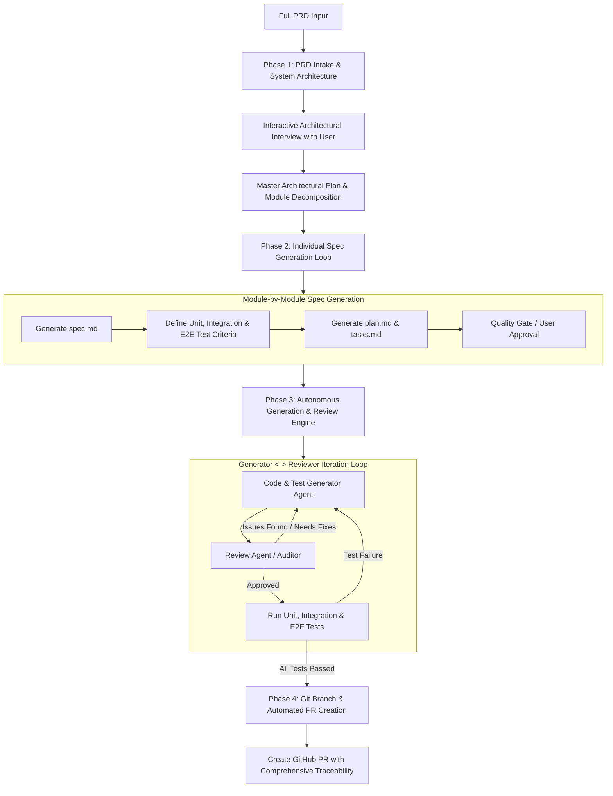

# Spec-Driven Full AI Workflow Implementation Plan (via GitHub Spec Kit)

Build an end-to-end Spec-Driven Development (SDD) autonomous workflow using [GitHub Spec Kit](https://github.com/github/spec-kit) integrated directly into the workspace. When given a full PRD, this system orchestrates:
1. Architectural analysis & interactive interview loops to clarify decisions.
2. Master architectural plan & module-by-module decomposition.
3. Individual portion spec generation with verifiable automated unit, integration, and E2E test criteria.
4. An autonomous Generation <-> Review Agent iterative refinement loop for code and tests.
5. Automated test execution and convergence verification.
6. Git branching and automated GitHub Pull Request creation with rich PR documentation.

---

## Architecture & Workflow Overview

---

## Detailed Components

### 1. Spec Kit Foundation & Integration
- Scaffold Spec Kit using native `agy` (Antigravity) integration.
- Install `.specify/` configuration, templates, workflows, and shared infrastructure.
- Establish project principles in `.specify/memory/constitution.md`.

### 2. Antigravity Interactive Skills
- **`/sdd-intake`**: Ingest PRD, analyze architecture, and conduct structured interactive interviews (via `ask_question` and targeted interview prompts) to resolve design choices and edge cases.
- **`/sdd-spec`**: Generate individual module specifications with automated test criteria, integration contracts, and automated E2E test scenarios.
- **`/sdd-loop`**: Autonomous generator <-> reviewer multi-agent iterative loop.
- **`/sdd-pr`**: Automated branch creation, test gate verification, and GitHub PR generation via `gh`.

### 3. Orchestration Engine (`scripts/sdd_engine.py`)
A cross-platform Python CLI engine capable of executing each stage either interactively or headlessly:
- PRD ingestion & architectural analysis
- Interactive questionnaire generator
- Spec decomposer
- Generator <-> Reviewer iteration loop (up to $N$ iterations)
- Test suite runner (unit tests, integration tests, E2E tests)
- Git & GitHub PR automation (`gh pr create`)

### 4. Verification & Documentation
- Comprehensive user guide: `docs/sdd-workflow-guide.md`
- Working sample PRD: `docs/sample-prd.md`
- Automated self-tests and dry-run capabilities.
