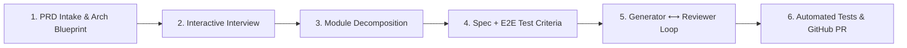

# Spec-Driven Full AI Workflow: Complete Guide

Welcome to the **Spec-Driven Full AI Workflow** for this repository, built on top of [GitHub Spec Kit](https://github.com/github/spec-kit).

This workflow transforms raw Product Requirements Documents (PRDs) into tested, reviewed, production-ready code with automated GitHub Pull Requests.

---

## 🌟 The 6-Stage Autonomous Pipeline



---

## 🚀 How to Use the Workflow

You have two execution options: **Interactive Agent Mode** (pair programming directly in this chat) or **Automated CLI Mode**.

### Mode A: Interactive Agent Mode (Recommended for Development)

#### 1. Provide Your PRD
Simply provide your PRD in the chat or tell Antigravity:
> "Here is my PRD: [paste content or specify `docs/sample-prd.md`]. Please run `/sdd-intake`."

#### 2. Answer the Architectural Interview
Antigravity will inspect the PRD, identify architectural choices (services, database, messaging, auth, E2E framework), and present an interactive questionnaire using `ask_question`. You can choose options or let the recommended defaults apply.

#### 3. Review the Master Architecture & Roadmap
Antigravity writes:
- `.specify/architecture/system-architecture.md`
- `.specify/architecture/module-decomposition.md`
- `.specify/memory/constitution.md`

#### 4. Generate Specifications Module-by-Module
Run:
```text
/sdd-spec auth-service
```
This generates:
- `.specify/specs/auth-service/spec.md`: User stories, acceptance criteria, and **mandatory automated unit, integration, and E2E test scenarios**.
- `.specify/specs/auth-service/plan.md`: Technical design.
- `.specify/specs/auth-service/tasks.md`: Actionable task list.
- `.specify/specs/auth-service/checklist.md`: Quality checklist.

#### 5. Execute the Autonomous Code Generation & Review Loop
Run:
```text
/sdd-loop auth-service
```
The **Generator Agent** writes the code and test suites. The **Review Agent** acts as an auditor inspecting:
1. Acceptance criteria adherence
2. Automated test completeness (Unit, Integration, E2E)
3. Clean Architecture & security standards
4. Error handling & edge cases

If the reviewer finds issues, it automatically loops back to the generator with specific action items. Once approved, it executes the automated test runner until all tests pass.

#### 6. Raise the Automated Pull Request
Run:
```text
/sdd-pr auth-service
```
This checks out a feature branch (`feature/auth-service`), commits the changes, generates a detailed PR description (`pr-body.md`) tracing back to the PRD and specs, and executes `gh pr create`.

---

### Mode B: CLI Orchestrator Engine (`scripts/sdd_engine.py`)

You can also run every step or the full pipeline headlessly or from any terminal:

#### 1. End-to-End Single Command Run
```bash
python scripts/sdd_engine.py run-all --prd docs/sample-prd.md --module auth-service --mock --dry-run
```

#### 2. Granular Step Commands
```bash
# Step 1 & 2: Ingest PRD & conduct architectural interview
python scripts/sdd_engine.py intake --prd docs/sample-prd.md

# Step 3: Generate module specification with automated test criteria
python scripts/sdd_engine.py spec --module catalog-service

# Step 4: Run the Generator <-> Reviewer multi-agent loop
python scripts/sdd_engine.py loop --module catalog-service --iterations 3

# Step 5: Finalize and raise Pull Request
python scripts/sdd_engine.py pr --module catalog-service --dry-run
```

---

## 📁 Workspace Artifacts Directory Structure

```text
.specify/
├── architecture/
│   ├── interview-answers.json      # User choices from architectural interview
│   ├── module-decomposition.md     # Module roadmap & dependency sequence
│   └── system-architecture.md      # High-level architecture blueprint
├── memory/
│   └── constitution.md             # Non-negotiable engineering principles
├── specs/
│   └── <module-slug>/
│       ├── spec.md                 # Specifications & E2E Test Criteria
│       ├── plan.md                 # Technical implementation plan
│       ├── tasks.md                # Task list
│       ├── checklist.md            # Quality gate checklist
│       ├── review-log.md           # Multi-agent audit findings & test reports
│       └── pr-body.md              # Traceability PR description
└── workflows/
    └── sdd-full/
        └── workflow.yml            # Spec Kit workflow definition
```

---

## 🛠️ Installed Antigravity Skills Reference

| Slash Command | Skill Location | Description |
| :--- | :--- | :--- |
| `/sdd-intake` | `.agents/skills/sdd-intake/SKILL.md` | Ingests PRD, creates architecture, conducts interactive interview |
| `/sdd-spec` | `.agents/skills/sdd-spec/SKILL.md` | Generates module spec with automated unit, integration, and E2E criteria |
| `/sdd-loop` | `.agents/skills/sdd-loop/SKILL.md` | Runs Generator <-> Reviewer refinement loop and executes test suite |
| `/sdd-pr` | `.agents/skills/sdd-pr/SKILL.md` | Verifies tests, creates feature branch, and raises GitHub PR |
| `/speckit-constitution` | `.agents/skills/speckit-constitution/SKILL.md` | Core GitHub Spec Kit project constitution tool |
| `/speckit-specify` | `.agents/skills/speckit-specify/SKILL.md` | Core GitHub Spec Kit baseline feature spec generator |
| `/speckit-plan` | `.agents/skills/speckit-plan/SKILL.md` | Core GitHub Spec Kit technical planner |
| `/speckit-tasks` | `.agents/skills/speckit-tasks/SKILL.md` | Core GitHub Spec Kit task breakdown tool |
| `/speckit-converge` | `.agents/skills/speckit-converge/SKILL.md` | Core GitHub Spec Kit convergence checker |
