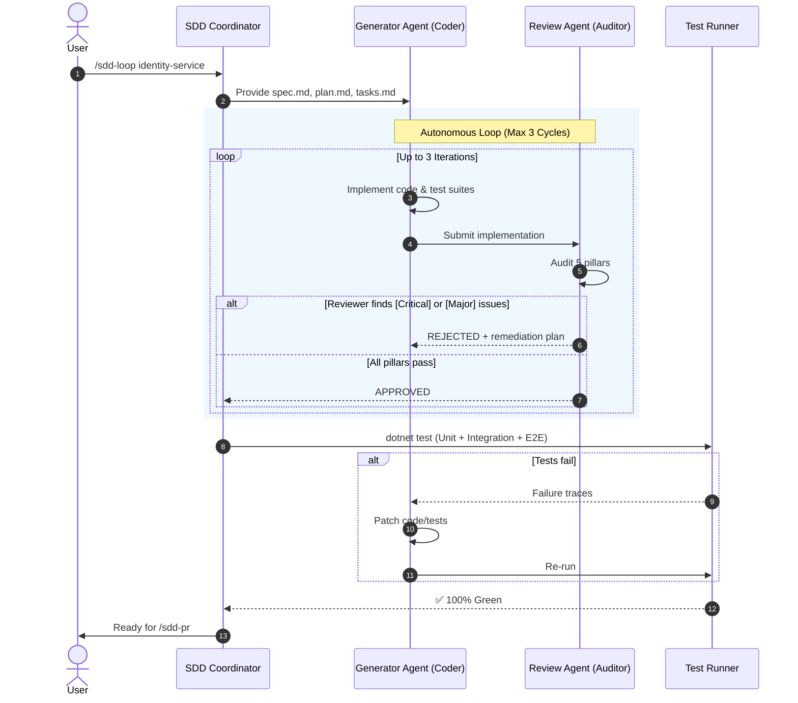
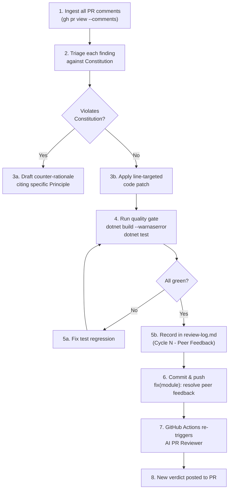

# 📖 Shopizy SDD Workflow — Complete Guide

This guide covers every stage of the **Spec-Driven Development (SDD) AI Workflow** used to build the Shopizy Microservices Platform. Each module is built through a rigorous, fully autonomous pipeline that takes a PRD to a reviewed, tested, merged PR.

---

## Table of Contents

1. [Overview & Philosophy](#1-overview--philosophy)
2. [Full Pipeline Walkthrough](#2-full-pipeline-walkthrough)
3. [The Generator ↔ Reviewer Loop](#3-the-generator--reviewer-loop)
4. [The Google AI PR Review Agent](#4-the-google-ai-pr-review-agent)
5. [The Peer Feedback Resolution Loop](#5-the-peer-feedback-resolution-loop)
6. [Stacked PR Strategy](#6-stacked-pr-strategy)
7. [Slash Command Reference](#7-slash-command-reference)
8. [Workspace Artifacts Reference](#8-workspace-artifacts-reference)

---

## 1. Overview & Philosophy

The SDD workflow is built on the principle that **specifications must precede code**. Before a single line of implementation is written, the AI:

1. Forces explicit decisions about architecture, database design, and inter-service contracts
2. Generates verifiable acceptance criteria that become the test suite
3. Audits every implementation against those criteria through an adversarial Review Agent

This produces code that is:
- **Correct by construction** — tests exist before code
- **Architecturally sound** — every layer boundary is audited
- **Fully traceable** — PRDs → specs → code → tests → PR

---

## 2. Full Pipeline Walkthrough

### Stage 0: Repository Bootstrap (One-Time)

The skills are pre-installed in `.agents/skills/`. The GitHub Actions workflows are in `.github/workflows/`. The project constitution is at `.specify/memory/constitution.md`.

No installation needed — just start chatting in Antigravity.

---

### Stage 1: PRD Intake & Architectural Interview (`/sdd-intake`)

**Command:**
```text
/sdd-intake docs/Shopizy_PRD.md
```

**What happens:**
1. AI reads the full PRD and extracts all business requirements, user types, and non-functional requirements.
2. AI presents an interactive architectural interview covering:
   - Service boundaries and subdomain carving
   - Database technology choices (PostgreSQL vs. Redis vs. Elasticsearch)
   - Messaging strategy (RabbitMQ + MassTransit with Outbox)
   - Authentication approach (JWT, RBAC roles)
   - Testing strategy (xUnit, FluentAssertions, Aspire test host)
3. Answers are ratified and saved to `.specify/architecture/interview-answers.json`.

**Output artifacts:**
- `.specify/architecture/system-architecture.md` — Full topology diagram, CQRS pattern, concurrency strategy
- `.specify/architecture/module-decomposition.md` — Dependency-ordered 13-module roadmap with E2E scenarios per module
- `.specify/memory/constitution.md` — 8 non-negotiable engineering principles

---

### Stage 2: Module Specification (`/sdd-spec`)

**Command:**
```text
/sdd-spec identity-service
```

**What happens:**
1. AI reads the constitution and module-decomposition roadmap.
2. Generates a formal specification for the target module covering:
   - **User Stories** with priority (Must Have / Should Have)
   - **Acceptance Criteria** expressed as explicit behavioral conditions
   - **API Schema** — endpoint paths, request/response DTOs, HTTP status codes
   - **Domain Model** — entities, value objects, aggregate roots, domain events
   - **Integration Events** — MassTransit contracts published or consumed
   - **Automated Test Criteria** — exact unit, integration, and E2E test scenarios
3. Generates implementation plan and actionable task list.

**Output artifacts:**
```
.specify/specs/identity-service/
├── spec.md          # User stories, acceptance criteria, API schema, E2E scenarios
├── plan.md          # Technical design, component diagram, migration plan
├── tasks.md         # Ordered, dependency-resolved implementation task list
└── checklist.md     # Pre-PR quality checklist
```

---

### Stage 3: Generator ↔ Reviewer Loop (`/sdd-loop`)

**Command:**
```text
/sdd-loop identity-service
```

This is the core autonomous AI loop. See [Section 3](#3-the-generator--reviewer-loop) for full details.

**Output artifacts:**
- Production source code in `src/Shopizy.IdentityService/`
- Test suites in `tests/Shopizy.IdentityService.UnitTests/` and `tests/Shopizy.IdentityService.IntegrationTests/`
- `.specify/specs/identity-service/review-log.md` — Full audit trail

---

### Stage 4: GitHub PR (`/sdd-pr`)

**Command:**
```text
/sdd-pr identity-service
```

**What happens:**
1. Verifies `dotnet build --warnaserror` passes (0 warnings, 0 errors).
2. Verifies all unit, integration, and E2E tests pass cleanly (100% pass rate).
3. **Mandatory README.md Synchronization**: Checks and updates `README.md` (roadmap status, test totals, project structure, and documentation links).
4. Creates feature branch:
   ```bash
   git checkout -b feature/<module-slug>
   ```
5. Commits all changes including source code, tests, specs, and `README.md`.
6. Generates `pr-body.md` with full PRD traceability, spec links, and test results.
7. Executes:
   ```bash
   gh pr create --title "feat(<module-slug>): ..." --body-file .specify/specs/<module-slug>/pr-body.md
   ```
8. **Review & Merge Gate**: Waits for GitHub Actions CI and Google AI Review Agent. If `CHANGES REQUESTED` or checks fail, accidental merge to `main` is strictly blocked until findings are resolved. Only when all checks are green and approved is squash merge executed.

---

### Stage 5: Automated AI PR Review

On every PR open or push, GitHub Actions triggers the **Google AI PR Review Agent**. See [Section 4](#4-the-google-ai-pr-review-agent) for full details.

---

### Stage 6: Peer Feedback Resolution

When a human or AI reviewer posts feedback, the AI agent resolves it through the structured resolution loop. See [Section 5](#5-the-peer-feedback-resolution-loop) for full details.

---

## 3. The Generator ↔ Reviewer Loop

### Architecture



### The 5-Pillar Review Framework

| Pillar | Review Agent Inspection Criteria |
|:---|:---|
| **1. Spec Adherence** | Are ALL user stories implemented? Do API paths, request/response schemas, and HTTP status codes match the spec exactly? |
| **2. Test Completeness** | Do unit, integration, and E2E tests exist? Are assertions meaningful (no `.Should().BeTrue()` vacuities)? Are all acceptance criteria covered by at least one test? |
| **3. Architecture & Standards** | Clean Architecture layers intact? No ORM in Domain? No cross-service database queries? Constitution compliant? |
| **4. Error & Edge Cases** | Nulls, empty collections, boundary values, duplicate keys, and exception paths handled? RFC 7807 Problem Details returned (no raw stack traces)? |
| **5. Security & Performance** | All endpoints require auth (where applicable)? Idempotency enforced on financial operations? No hardcoded secrets? Multi-tenant isolation verified? |

### Review Outcomes

- **APPROVED**: `STATUS: APPROVED` written to `review-log.md`. Proceed to `/sdd-pr`.
- **REJECTED**: Specific defects with exact file references and suggested fixes written to `review-log.md`. Generator Agent patches the code. Loop repeats.
- **Max iterations exceeded**: SDD Coordinator reports the blocker to the user.

---

## 4. The Google AI PR Review Agent

### Workflow

The agent is defined in:
- `.github/workflows/pr-review-agent.yml` — Triggers on `pull_request` events
- `.github/scripts/pr_review_agent.py` — Python script using the Gemini API

### What It Reads

The agent constructs its review from:
1. **PR metadata**: title, description (traceability to PRD and spec)
2. **Project Constitution** (`.specify/memory/constitution.md`)
3. **Full PR diff** (unified diff of all changed files)

### Line-Number Attribution

Line numbers are calculated from unified diff hunk headers:
```
@@ -83,19 +83,15 @@ public static class Extensions
```
The `+` side gives the new file line numbers. All findings reference exact lines:
```markdown
#### 📍 `src/Shopizy.ServiceDefaults/Extensions.cs:L88-L98` — [Severity: Major] Title
```

### Verdict Decision Matrix

| Verdict | Trigger Condition | Merge Blocking? |
|:---|:---|:---:|
| `❌ CHANGES REQUESTED` | Any finding with severity `[Critical]` or `[Major]` | ⛔ Yes |
| `⚠️ APPROVED WITH SUGGESTIONS` | All critical gates pass; only `[Minor]` or `[Nit]` remain | 🟢 No |
| `✅ APPROVED` | Zero findings; 100% test pass; 0 warnings | 🟢 No |

#### When `❌ CHANGES REQUESTED` (strictly blocks merge to main):
- The script submits a formal Pull Request Review with `REQUEST_CHANGES`, prints an error annotation, and **exits with code 1**, failing the GitHub Actions check.
- Constitution violation (e.g., Domain references EF Core)
- Security flaw (hardcoded secret, missing auth, stack trace leak)
- Business invariant risk (overselling race condition, missing idempotency)
- Test deficit (acceptance criteria without coverage, empty assertions)
- Build breakage (compiler warning under `--warnaserror`)

#### When `⚠️ APPROVED WITH SUGGESTIONS` (non-blocking):
- Developer ergonomics (e.g., `WithDataVolume()` for local persistence)
- Non-critical path performance suggestions
- Documentation, naming, or code clarity improvements

#### When `✅ APPROVED` (production-ready):
- Zero defects of any severity
- 100% acceptance criteria covered by tests
- Full constitution compliance
- Zero compiler warnings

### Setup Requirements

1. **GitHub Secret**: Add `GEMINI_API_KEY` in repository Settings → Secrets → Actions.
2. The workflow file is already present at `.github/workflows/pr-review-agent.yml`.

---

## 5. The Peer Feedback Resolution Loop

### When to Trigger

After any human or AI review posts feedback on a PR, tell the AI agent:
```text
Address the feedback on PR #2
```

Or paste the specific comment:
```text
Reviewer said: "The health check endpoints are gated behind IsDevelopment() which breaks production probes."
Please resolve this on the current branch.
```

### Resolution Flow



### Traceability

Every resolution cycle is logged in `.specify/specs/<module>/review-log.md`:

```markdown
| **Cycle 3 (Peer Feedback)** | **APPROVED** |
| Finding: `Extensions.cs:L88-L98` — MapDefaultEndpoints gated by IsDevelopment() |
| Resolution: Removed environment check; health probes now available in all environments |
| Verification: 30/30 tests, 0 warnings |
```

---

## 6. Stacked PR Strategy

To avoid blocking development on unmerged PRs, each module branch stacks on the previous:

```
main
└── feature/shared-kernel   (PR #1)
    └── feature/identity-service   (PR #2, branches from shared-kernel)
        └── feature/catalog-service   (PR #3, branches from identity-service)
            └── ...
```

**Creating the next stacked branch:**
```bash
git checkout -b feature/identity-service origin/feature/shared-kernel
```

**CI handling**: Each workflow runs against the full `Shopizy.sln` so integration across the stack is always verified.

**Merging order**: Merge base branches first. Once `feature/shared-kernel` merges to `main`, `feature/identity-service` automatically retargets to include only its own diff.

---

## 7. Slash Command Reference

| Command | Skill | Description |
|:---|:---|:---|
| `/sdd-intake <prd>` | `.agents/skills/sdd-intake/` | Ingests PRD, conducts architectural interview, generates blueprint & roadmap |
| `/sdd-spec <module>` | `.agents/skills/sdd-spec/` | Generates formal spec with user stories, E2E criteria, and task list |
| `/sdd-loop <module>` | `.agents/skills/sdd-loop/` | Runs Generator ↔ Reviewer loop, executes tests, produces `review-log.md` |
| `/sdd-pr <module>` | `.agents/skills/sdd-pr/` | Verifies build/tests, creates stacked branch, generates PR body, raises GitHub PR |
| `/speckit-specify <module>` | `.agents/skills/speckit-specify/` | GitHub Spec Kit baseline feature spec generator |
| `/speckit-plan <module>` | `.agents/skills/speckit-plan/` | GitHub Spec Kit technical planner |
| `/speckit-tasks <module>` | `.agents/skills/speckit-tasks/` | GitHub Spec Kit actionable task breakdown |
| `/speckit-clarify <module>` | `.agents/skills/speckit-clarify/` | Interactive clarification of underspecified areas |
| `/speckit-analyze` | `.agents/skills/speckit-analyze/` | Cross-artifact consistency analysis |
| `/speckit-checklist <module>` | `.agents/skills/speckit-checklist/` | Generate custom quality checklist |
| `/speckit-converge <module>` | `.agents/skills/speckit-converge/` | Assess codebase against spec, append unbuilt tasks |
| `/speckit-implement <module>` | `.agents/skills/speckit-implement/` | Execute tasks.md implementation plan |
| `/speckit-taskstoissues <module>` | `.agents/skills/speckit-taskstoissues/` | Convert tasks to GitHub Issues |
| `/speckit-constitution` | `.agents/skills/speckit-constitution/` | Create or update project constitution |

---

## 8. Workspace Artifacts Reference

```
.specify/
├── architecture/
│   ├── interview-answers.json        # Ratified architectural decisions from interactive interview
│   ├── module-decomposition.md       # 13-module dependency-ordered roadmap with E2E scenarios
│   └── system-architecture.md        # Topology, CQRS, concurrency strategy, tech rationale
├── memory/
│   └── constitution.md               # 8 non-negotiable engineering principles (governance doc)
└── specs/
    └── <module-slug>/
        ├── spec.md                   # User stories, acceptance criteria, API schema, E2E scenarios
        ├── plan.md                   # Technical implementation design & component diagram
        ├── tasks.md                  # Ordered, dependency-resolved task list
        ├── checklist.md              # Pre-PR quality checklist
        ├── review-log.md             # Full multi-agent audit trail & automated test results
        └── pr-body.md                # Generated PR description with PRD traceability
```

### Key Files

| File | Purpose |
|:---|:---|
| `constitution.md` | Read by the AI Review Agent on every PR review |
| `spec.md` | Source of truth for acceptance criteria and test scenarios |
| `review-log.md` | Immutable audit trail: iterations, findings, resolutions, test results |
| `pr-body.md` | Auto-generated PR body with links to PRD sections, spec, and test results |
| `.github/scripts/pr_review_agent.py` | Google AI Gemini-powered PR review script |
| `.github/workflows/pr-review-agent.yml` | GitHub Actions trigger for AI review |
