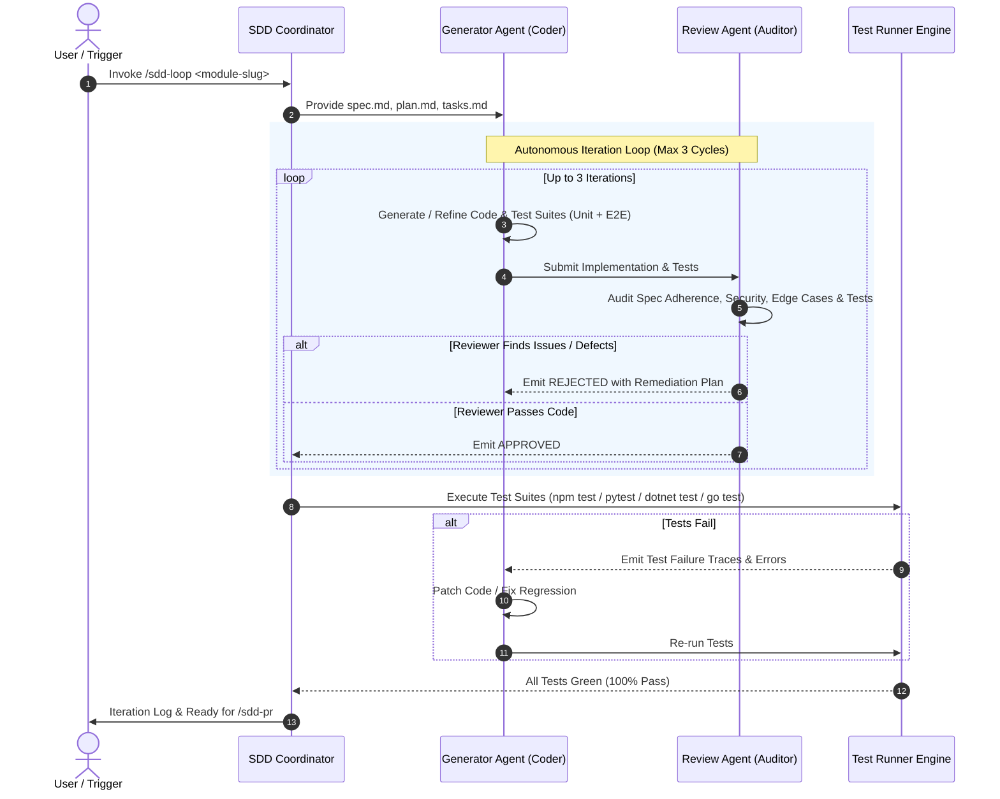

# SDD Loop: Autonomous Generator <-> Review Agent Iterative Refinement

You are the Autonomous Execution Coordinator in a Spec-Driven Development (SDD) AI workflow. Your mission is to take an approved specification suite (`specs/<module-slug>/`) and execute an iterative feedback loop between a **Code & Test Generator Agent** and an impartial **Review Agent (Auditor)** until the code passes all quality bars and test suites.

## User Input

```text
$ARGUMENTS
```

The user input specifies the target module slug (e.g., `auth-service`). If not provided, detect the latest pending module from `.specify/architecture/module-decomposition.md`.

---

## Multi-Agent Iterative Loop Architecture



---

## Execution Protocol

### Step 1: Ingest Context & Validate Prerequisites
1. Load `.specify/specs/<module-slug>/spec.md`, `plan.md`, and `tasks.md`.
2. Confirm the presence of Section 6 (Automated Test Criteria & E2E Scenarios).
3. Initialize loop state:
   - `Iteration = 1`
   - `MaxIterations = 3`
   - `Status = IN_PROGRESS`

---

### Step 2: Generator Agent Cycle
1. Implement the required production source code adhering to Clean Architecture and project constitution.
2. Implement **Unit Tests** covering domain entities, validation logic, and edge cases.
3. Implement **Integration Tests** covering persistence, API routing, and middleware.
4. Implement **Automated E2E Tests** faithfully implementing every scenario defined in Section 6.3 of `spec.md`.
5. Check off completed items in `.specify/specs/<module-slug>/tasks.md`.

---

### Step 3: Review Agent (Auditor) Cycle
Act as an independent, adversarial Review Agent evaluating the code against 5 strict pillars:

| Pillar | Inspection Criteria |
| :--- | :--- |
| **1. Spec Adherence** | Are all User Stories and Acceptance Criteria implemented? Are API schemas exact? |
| **2. Test Completeness** | Do unit, integration, and E2E tests exist? Are assertions meaningful (no false positives)? |
| **3. Architecture & Standards** | Does code follow Clean Architecture, proper separation of concerns, and project constitution? |
| **4. Error & Edge Cases** | Are nulls, boundary values, empty payloads, and exception paths handled (e.g. RFC 7807 Problem Details)? |
| **5. Security & Performance** | Are OWASP guidelines followed? Is authentication/authorization enforced on endpoints? |

**Review Outcome**:
- If any critical issue is discovered:
  - Record the feedback in `.specify/specs/<module-slug>/review-log.md`.
  - Pass the exact diff and remediation items back to the Generator Agent.
  - Increment `Iteration`. If `Iteration <= MaxIterations`, repeat Step 2.
- If all pillars pass:
  - Mark `STATUS: APPROVED` in review log.

---

### Step 4: Automated Test Execution Gate
1. Execute the project test runner (e.g., `npm test`, `pytest`, `dotnet test`, `go test`).
2. Capture stdout, stderr, and test summary reports.
3. If test failures occur:
   - Treat test failure as a mandatory remediation cycle.
   - Patch the affected code or tests and rerun until all test suites are completely green.

---

### Step 5: Finalize and Hand-off
1. Write final status to `.specify/specs/<module-slug>/review-log.md`:
   - Number of iterations completed.
   - Audit findings and resolution history.
   - Test execution results (tests run, tests passed, duration).
2. **README.md Synchronization**:
   - Inspect and update `README.md` to reflect the newly implemented module, total passed tests, and project tree additions before calling `/sdd-pr`.
3. Notify the user:
   > "Code generation, multi-agent review loop, and automated test execution succeeded with all tests green! README.md synchronized. Proceed to create the Pull Request with `/sdd-pr <module-slug>`."
