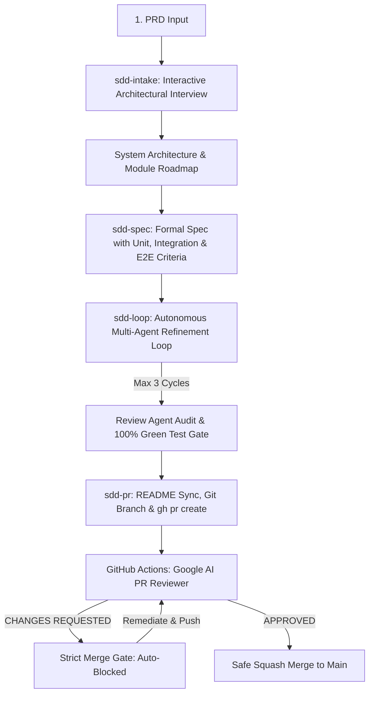

# 🚀 Autonomous Spec-Driven SDLC Toolkit

A production-tested, fully autonomous **Spec-Driven Development (SDD) AI Workflow** that transforms Product Requirements Documents (PRDs) into production code, comprehensive automated test suites (Unit, Integration, E2E), and verified GitHub Pull Requests with autonomous AI code reviews.

---

## 📦 What's in This Toolkit?

```text
extracted-sdlc-toolkit/
├── .agents/
│   └── skills/
│       ├── sdd-intake/SKILL.md         # Stage 1: PRD Ingestion & Architectural Interview
│       ├── sdd-spec/SKILL.md           # Stage 2: Spec generation with mandatory E2E criteria
│       ├── sdd-loop/SKILL.md           # Stage 3: Autonomous Generator <-> Reviewer refinement loop
│       └── sdd-pr/SKILL.md             # Stage 4: Branch, README sync, and GitHub PR creation
├── .github/
│   ├── scripts/
│   │   └── pr_review_agent.py          # Google AI Gemini PR Reviewer with line-by-line attribution
│   └── workflows/
│       ├── ci-template.yml             # Strict CI quality gate (lint, build --warnaserror, test)
│       └── pr-review-agent.yml         # GitHub Actions trigger for AI PR reviews
├── .specify/
│   ├── memory/
│   │   └── constitution.md             # Core engineering standards & layer boundaries
│   ├── templates/
│   │   ├── checklist-template.md       # Pre-flight quality checklist
│   │   ├── plan-template.md            # Technical architecture layout
│   │   ├── spec-template.md            # Given-When-Then + automated test criteria
│   │   └── tasks-template.md           # Dependency-ordered task list
│   └── workflows/
│       └── sdd-full/
│           └── workflow.yml            # Spec-Kit multi-agent pipeline definition
└── scripts/
    └── sdd_engine.py                   # Portable Python CLI orchestrator
```

---

## ⚡ 3-Minute Quickstart for Any Project

### Step 1: Copy Toolkit Files into Your Repository
Copy the contents of `extracted-sdlc-toolkit/` directly into the root of your target project:

```bash
# In your target project repository:
cp -r /path/to/extracted-sdlc-toolkit/.agents .
cp -r /path/to/extracted-sdlc-toolkit/.github .
cp -r /path/to/extracted-sdlc-toolkit/.specify .
cp -r /path/to/extracted-sdlc-toolkit/scripts .
```

### Step 2: Configure GitHub Repository Secret
To enable the autonomous Google AI PR Reviewer:
1. Generate a free Gemini API key from [Google AI Studio](https://aistudio.google.com/).
2. Navigate to your GitHub repository **Settings** ➔ **Secrets and variables** ➔ **Actions**.
3. Create a new repository secret named `GEMINI_API_KEY` and paste your key.

### Step 3: Run the Workflow!
You can run the SDLC workflow using either **Antigravity Slash Commands** or the **Standalone Python CLI**:

#### Option A: Inside Antigravity / Agent Chat
```text
1. /sdd-intake docs/prd.md       # Ingest PRD & complete interactive interview
2. /sdd-spec auth-service        # Generate module spec with automated E2E criteria
3. /sdd-loop auth-service        # Run Generator <-> Reviewer autonomous coding loop
4. /sdd-pr auth-service          # Run test suite, update README, and create GitHub PR
```

#### Option B: Standalone CLI
```bash
# Run complete end-to-end pipeline in one command
python scripts/sdd_engine.py run-all --prd docs/prd.md --module auth-service

# Or step-by-step:
python scripts/sdd_engine.py intake --prd docs/prd.md
python scripts/sdd_engine.py spec --module auth-service
python scripts/sdd_engine.py loop --module auth-service
python scripts/sdd_engine.py pr --module auth-service
```

---

## 🔄 The 7-Stage SDLC Lifecycle



### Stage 1: PRD Intake & Interactive Architectural Interview (`/sdd-intake`)
- Ingests user PRD (`docs/prd.md`).
- Conducts an interactive interview resolving architecture, database engine, messaging broker, authentication, and testing frameworks.
- Generates `.specify/architecture/system-architecture.md` and `.specify/architecture/module-decomposition.md`.

### Stage 2: Spec-Driven Feature Specification (`/sdd-spec`)
- Generates `.specify/specs/<module-slug>/spec.md`, `plan.md`, `tasks.md`, and `checklist.md`.
- **Mandatory E2E Testing Gate**: Section 6 explicitly defines Unit, Integration, and end-to-end user journeys (Happy Path + Fault Injection/RFC 7807 Problem Details).

### Stage 3: Generator ↔ Reviewer Iterative Refinement Loop (`/sdd-loop`)
- Orchestrates an autonomous loop between a **Code & Test Generator Agent** and an impartial **Review Agent (Auditor)**.
- Reviewer audits code across 5 pillars:
  1. *Spec Adherence*
  2. *Test Completeness*
  3. *Architecture & Standards*
  4. *Error & Edge Cases*
  5. *Security & Performance*
- Rejection feeds back specific diffs and remediation items (up to 3 iterations).
- Executes local test runner until 100% pass rate is achieved.
- Records full audit trail in `review-log.md`.

### Stage 4: Pre-Flight Verification & PR Creation (`/sdd-pr`)
- Verifies build and test pass with zero warnings.
- Synchronizes `README.md` (roadmap table, test counts, directory layout).
- Creates git branch `feature/<module-slug>`, commits with conventional commit, and raises GitHub PR via `gh`.

### Stage 5: In-Repo Google AI PR Reviewer (`pr-review-agent.yml`)
- Triggers on every PR open or update.
- Reads PR metadata, full unified diff, and `.specify/memory/constitution.md`.
- Posts line-by-line findings with concrete copy-pasteable patches.
- Strict verdict rubric:
  - `❌ CHANGES REQUESTED`: Constitution violation, security vulnerability, test gap, or build warning. Exits with code 1, **blocking merge**.
  - `⚠️ APPROVED WITH SUGGESTIONS`: Non-blocking ergonomic or styling suggestions.
  - `✅ APPROVED`: Zero defects, 100% test coverage.

### Stage 6: Peer Feedback & Remediation Loop
- AI agent ingests review comments: `gh pr view <pr-number> --comments`.
- Triages each finding against the constitution, applies code patch, runs test suite, commits, pushes, and re-triggers AI review until approved.

### Stage 7: Strict Merge Gate & Stacked PR Strategy
- Squash merges to `main` only when all CI checks are green and verdict is approved.
- Allows stacked branches (`feature/module-2` branched from `feature/module-1`) so teams and agents are never blocked on pending reviews.

---

## 🛠️ Multi-Language Stack Customization

The toolkit automatically detects your runtime in `scripts/sdd_engine.py` and supports:

| Ecosystem | Linter / Build Command | Test Runner |
| :--- | :--- | :--- |
| **Node.js / TypeScript** | `npm run lint` / `tsc --noEmit` | `npm test` (Vitest / Jest) |
| **Python** | `ruff check .` / `mypy .` | `pytest` |
| **Go** | `golangci-lint run` | `go test ./...` |
| **.NET / C#** | `dotnet build --warnaserror` | `dotnet test` |
| **Rust** | `cargo clippy -- -D warnings` | `cargo test` |

Edit `.specify/memory/constitution.md` to encode your language-specific rules and layer boundaries.
